# BankAssist AI — Architecture

**Status:** Approved with amendments
**Version:** 0.3
**Date:** 2026-08-04

> **Amendment log — v0.3.** §5 (RAG architecture) and §11 rows 3–4 reconciled with what
> Lab 2 and Lab 3 actually built: Pinecone + OpenAI `text-embedding-3-small` replace
> ChromaDB + local MiniLM ([ADR-0007](../decisions/0007-pinecone-and-api-embeddings.md));
> reranking reinstates `sentence-transformers`, scoped to the cross-encoder only
> ([ADR-0008](../decisions/0008-reranker-dependency.md)); the enterprise classification
> labels, chunking description, and citation scope now match
> [`docs/requirements/lab-03-enterprise-rag.md`](../requirements/lab-03-enterprise-rag.md)
> rather than the pre-implementation sketch.

> **Amendment log — v0.2.** OpenAI is the initial provider (§9, §11 row 9); no second
> credential is a prerequisite. Economical models are the default tier. The guardrail
> layering is stated explicitly as deterministic-vs-classifier (§7.0). The semantic cache
> gains an explicit eligibility/bypass decision (§9.2, [ADR-0006](../decisions/0006-semantic-cache-eligibility.md)).
> Evaluation separates retrieval quality from generation quality and uses 20–25 cases (§8.2).
> Observability stays deliberately simple — JSONL plus a simple Streamlit view (§8).

Companion documents: [`technology-stack.md`](technology-stack.md),
[`../requirements/project-requirements.md`](../requirements/project-requirements.md),
[`../plan/implementation-plan.md`](../plan/implementation-plan.md),
[`../decisions/`](../decisions/).

---

## 1. Architectural stance

BankAssist AI is a **modular monolith**: one Python package, one process, strong internal
boundaries. Every layer that an enterprise deployment would run as a separate service
exists here as a module with an explicit interface — retrieval, orchestration, guardrails,
observability, caching. The seams are real; the deployment is not distributed.

This is deliberate. The lab's subject is *architecture*, and a distributed deployment would
consume the entire time budget in infrastructure while making every layer harder to
demonstrate. Each module's "how this scales in production" story is documented in §11
rather than built.

Three properties drive every decision below:

1. **Inspectability** — every stage explains its own output. If retrieval returns a chunk,
   you can see the score that put it there and the stage that let it through.
2. **Determinism at the edges** — chunking, fusion, guardrail rules, cost maths, and cache
   keys are pure and testable. Non-determinism is confined to the LLM boundary.
3. **Additive layering** — each lab adds a layer without demolishing the previous one.

---

## 2. High-level architecture

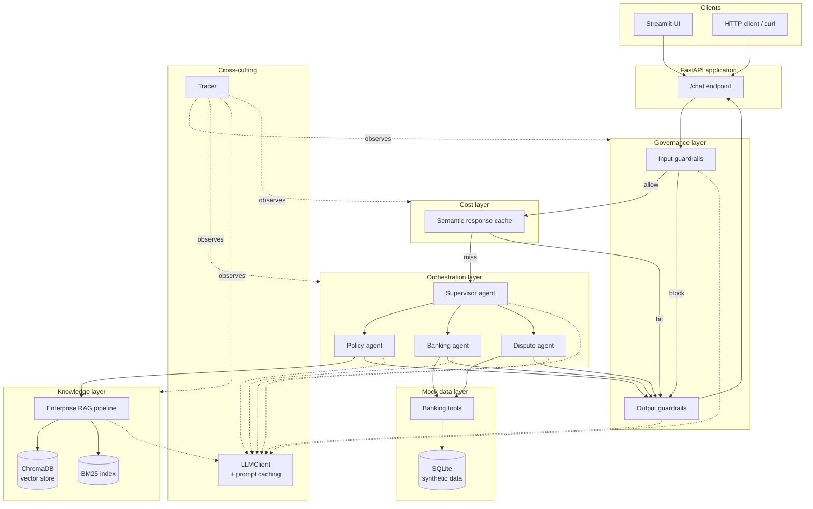

The dotted lines matter as much as the solid ones: **every** component reaches the model
through a single `LLMClient`, and **every** component reports to a single `Tracer`. Those
two chokepoints are what make Labs 6 and 7 possible at all.

---

## 3. Component responsibilities

| Component | Responsibility | Deliberately not responsible for |
|---|---|---|
| **API layer** (`api/`) | HTTP surface, request/response schemas, session handling, error mapping. | Business logic, prompting, retrieval. |
| **UI** (`ui/`) | Chat surface, trace browser, evaluation and cost dashboards. Source of screenshots. | Any logic not also available via the API. |
| **Guardrail engine** (`guardrails/`) | Runs ordered checks over input and output; returns typed verdicts with rule ids. | Deciding *what* to answer; that is the agents' job. |
| **Semantic cache** (`caching/`) | Embed query → similarity lookup → serve or store. Cacheability policy. | Correctness of the cached answer; it stores what the pipeline produced. |
| **Supervisor** (`agents/supervisor.py`) | Intent classification, routing, fan-out to multiple specialists, synthesis, loop bounds. | Domain answers. |
| **Policy agent** (`agents/policy.py`) | Grounded policy/product answers with citations, via the RAG pipeline. | Customer-specific data. |
| **Banking agent** (`agents/banking.py`) | Account, balance, and transaction questions via scoped tools. | Policy interpretation; disputes. |
| **Dispute agent** (`agents/dispute.py`) | Dispute eligibility, reason collection, case creation, status. | Deciding dispute outcomes. |
| **Tools** (`tools/`) | Typed, schema'd, customer-scoped access to mock data. | Any write beyond `create_dispute_case`. |
| **RAG pipeline** (`rag/`) | Classify → rewrite → hybrid retrieve → filter → rerank → build context. | Generation; it returns context, the agent generates. |
| **Vector store / BM25** | Dense and sparse candidate generation. | Ranking quality; that is the reranker's job. |
| **LLMClient** (`llm/`) | Single provider boundary. Prompt caching, retries, token/cost accounting. | Prompt content. |
| **Tracer** (`tracing/`) | Span creation, nesting, timing, attributes, persistence. | Interpreting what it recorded. |
| **Evaluation** (`evaluation/`) | Golden dataset, scorers, report generation, regression comparison. | Fixing what it finds. |

---

## 4. Request data flow

The end-to-end path a single question takes:

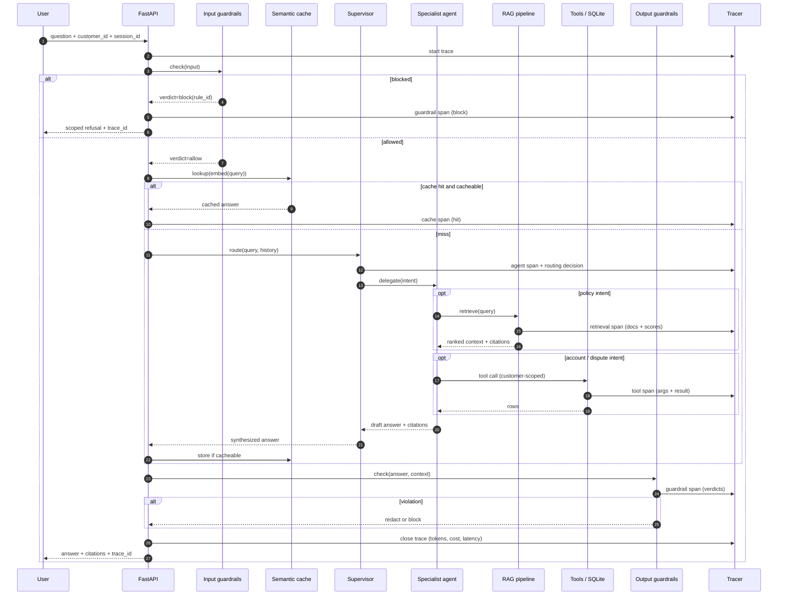

Two things worth noting. First, the **input guardrail runs before the cache** — a blocked
query must never be answered from cache. Second, the **output guardrail runs on the cached
path too**, so a cached response cannot bypass grounding and PII checks.

---

## 5. RAG architecture

> **Reconciled at Lab 3 (2026-08-04).** This section previously described a
> pre-implementation sketch (ChromaDB, local MiniLM embeddings, citation
> validation, session-history-aware rewriting) that predates
> [ADR-0007](../decisions/0007-pinecone-and-api-embeddings.md) and the actual
> Lab 3 build. It is updated below to match what exists:
> [`docs/requirements/lab-03-enterprise-rag.md`](../requirements/lab-03-enterprise-rag.md)
> is the authoritative spec.

### 5.1 Two pipelines, a shared `answer()` shape

Lab 2's basic pipeline is not thrown away when Lab 3 lands. `BasicRagPipeline`
(`rag/pipeline/basic_pipeline.py`) is untouched; `EnterpriseRagPipeline`
(`rag/pipeline/enterprise_pipeline.py`) is a new, independent pipeline selected
by the `mode` field on `POST /rag/query` — not a shared class hierarchy, since
their internals genuinely differ (single retrieval call vs. ten sequenced
stages). Both are constructed and cached independently in
`api/routes/rag.py`, so building one never requires the other.

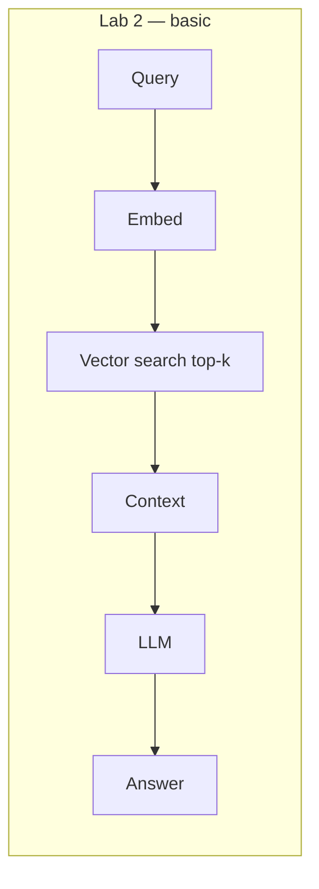

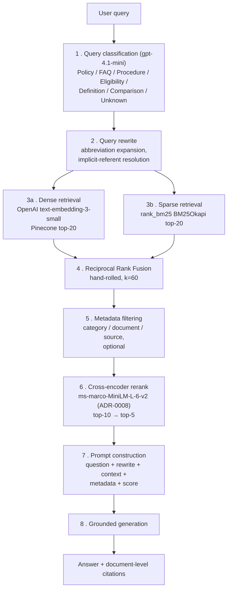

Query rewriting resolves implicit referents and expands abbreviations in the
single incoming question; there is no conversation-history state yet to
resolve pronouns against (that arrives with Lab 4's session handling).
Inline `[doc#chunk]` citation markers and their validation are **not** part of
Lab 3 — document-level citations only, matching Lab 2's shape. Both remain
candidates for Lab 5 (output guardrail) or Lab 6 (eval scoring).

### 5.2 Design notes

- **Chunking**: unchanged from Lab 2 — a deterministic, character-based
  splitter (700–900 chars, 120 overlap, paragraph → sentence → whitespace
  boundary preference; see `docs/requirements/lab-02-basic-rag.md` §3 FR-L2-3).
  Not token-based, not heading-aware. Enterprise mode's BM25 index is built
  from this same chunked corpus, not a second chunking pass.
- **Why hybrid**: dense retrieval is strong on paraphrase and weak on exact
  tokens. A user asking about the chargeback window by its exact wording is
  the canonical case where BM25 wins outright. Fusing both is the cheapest
  large accuracy gain available.
- **Fusion**: Reciprocal Rank Fusion (`score = Σ 1/(k + rank)`, k=60),
  implemented by hand in `rag/stages/rrf_ranker.py` — no external RRF library.
  Rank-based, so it needs no score normalization between two incomparable
  scoring systems. Deterministic and directly unit-tested against hand-computed
  fixtures.
- **Reranking**: `cross-encoder/ms-marco-MiniLM-L-6-v2`, scoring query and
  chunk *jointly*, which the bi-encoder embeddings used for dense retrieval
  cannot. Runs locally via `sentence-transformers`, reinstated for this
  purpose only — [ADR-0008](../decisions/0008-reranker-dependency.md) — since
  ADR-0007 had removed it. Embeddings themselves stay on OpenAI.
- **Citations**: document-level only, same shape as Lab 2's `sources` list —
  the distinct source documents behind the top-5 reranked chunks actually used
  in the prompt. Inline per-chunk markers and their validation are deferred
  (see §5.1).

---

## 6. Agent architecture

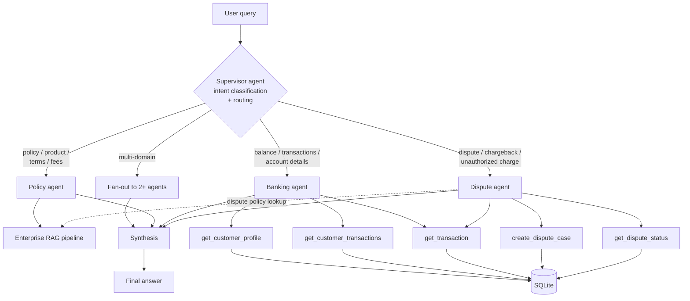

### 6.1 Orchestration model

Routing is **LLM-driven with a deterministic fallback**. The supervisor makes one
low-cost classification call (economical tier) that returns a structured intent; if the call
fails or returns an unknown intent, a keyword-based fallback classifier decides. That
fallback is not a nicety — it means routing is testable without a live model and the demo
never dies on a transient API error.

Specialist agents run a bounded tool-calling loop:

```
for turn in range(MAX_TURNS):          # MAX_TURNS = 5
    response = llm.call(messages, tools=agent_tools)
    if not response.tool_calls:
        return response.text
    for call in response.tool_calls:   # MAX_TOOL_CALLS budget enforced
        result = execute(call, customer_id=ctx.customer_id)
        messages.append(tool_result(result))
return partial_answer(messages)        # bounded, never spins
```

The `customer_id` is **injected by the runtime, not supplied by the model**. This is the
central tool-guardrail decision: the model chooses *which* tool and *what* transaction id,
but it cannot choose *whose* data. Cross-customer access is therefore not a policy the
model must obey — it is structurally impossible.

### 6.2 Why hand-written rather than a framework

An orchestration framework would supply the loop above and take the trace, the guardrail
hooks, and the cost accounting with it — behind abstractions the lab write-up would then
have to explain second-hand. Roughly 200 lines of explicit supervisor code keeps every hop
visible, keeps the trace exact, and removes a large dependency. Recorded as
[ADR-0002](../decisions/0002-hand-written-orchestration.md).

---

## 7. Guardrail architecture

Guardrails are a **pipeline of ordered checks**, cheapest and most certain first. Each
returns a typed `GuardrailVerdict { rule_id, decision, severity, rationale, matched_span }`.
The engine short-circuits on the first `block`. Every verdict — from either layer — is
written to the trace, so any decision can be audited after the fact.

### 7.0 Which layer decides what

The governing rule: **a check must not use an LLM where a deterministic rule decides the
same property.** Deterministic checks are free, instant, reproducible, and cannot be
argued out of firing; classifier checks cost money and latency and are themselves
attackable. Running the deterministic layer first means the fallible layer only ever sees
what survived the certain one.

| Property | Layer | Why |
|---|---|---|
| Known PII patterns (PAN, SSN-shaped, CVV) | **Deterministic** — regex | Decidable by pattern; a regex cannot be talked out of firing |
| Sensitive banking identifiers (account, routing, card) | **Deterministic** — regex + checksum shape | Same |
| Malformed or oversized input | **Deterministic** — schema + length bounds | Decidable; also a cheap denial-of-wallet control |
| Output masking | **Deterministic** — transform | Must be reliable, not probabilistic |
| Tool allow-lists and argument schemas | **Deterministic** — schema validation | Authorization must never be a model's judgement call |
| Citation *structural* validation | **Deterministic** — resolve id against retrieved set | Exact set-membership check |
| Prompt-injection / jailbreak **intent** | **Classifier** | Framing and novelty are not pattern-decidable |
| Personalized-financial-advice **intent** | **Classifier** | The allow/restrict boundary is semantic, not lexical (§7.1) |
| Unsupported or unsafe semantic output | **Classifier** | Grounding is a judgement about meaning |

Deterministic rules also carry the input stage's first pass at injection: literal markers
("ignore previous instructions"), delimiter injection, and role-override phrasing are
caught lexically before the classifier is asked about intent.

```mermaid
graph TB
    IN[User input] --> L1

    subgraph Input["Input guardrails"]
        L1[1 . Deterministic rules<br/>regex: injection markers,<br/>PAN / SSN / CVV patterns] --> L2
        L2[2 . Heuristics<br/>delimiter injection,<br/>role-override, encoding tricks] --> L3
        L3[3 . LLM classifier — economical tier<br/>jailbreak, out-of-domain,<br/>financial-advice intent]
    end

    L3 -->|block| REF[Scoped refusal<br/>+ rule id in trace]
    L3 -->|allow| FS

    subgraph Financial["Financial-safety classifier"]
        FS{Educational or<br/>personalized?}
    end

    FS -->|"general education,<br/>product / policy explanation"| OK[Allow]
    FS -->|"specific security,<br/>specific amount,<br/>personal allocation"| REF

    OK --> AG[Agent execution]

    subgraph Tool["Tool guardrails"]
        TG1[customer_id injected by runtime]
        TG2[Schema validation on every call]
        TG3[Write ops: precondition check<br/>+ mandatory trace record]
        TG4[No transfer / payment tool exists]
    end

    AG --> TG1 --> TG2 --> TG3 --> TG4 --> RET

    subgraph RAGG["RAG guardrails"]
        RET[Retrieved chunks] --> W[Wrap in untrusted-data<br/>delimiters]
        W --> SP[System prompt asserts:<br/>content inside is information,<br/>never instruction]
        SP --> DET[Detect instruction-shaped<br/>text; surface, do not obey]
    end

    DET --> GEN[Generation]

    subgraph Output["Output guardrails"]
        GEN --> O1[1 . PII / PAN / account-number scan<br/>→ redact]
        O1 --> O2[2 . Personalized-advice scan<br/>→ block]
        O2 --> O3[3 . Unsupported financial claims<br/>→ flag]
        O3 --> O4[4 . Grounding check vs context<br/>→ flag]
        O4 --> O5[5 . Citation resolution<br/>→ block on unresolvable id]
    end

    O5 --> FINAL[Delivered response]

    style REF fill:#7f1d1d,color:#fff
    style FINAL fill:#14532d,color:#fff
```

### 7.1 The allow/restrict boundary

The financial-safety guardrail is the one most likely to be built wrong, because the easy
implementation — block anything mentioning investing — is both useless and untestable as a
success.

| Allowed | Restricted |
|---|---|
| "How does compound interest work?" | "Should I put $50,000 into NVDA?" |
| "What is an index fund?" | "Is now a good time to buy tech stocks?" |
| "What's the difference between a Roth and traditional IRA?" | "Given my balance, what should I invest in?" |
| "How is my card's APR calculated?" | "Rebalance my portfolio to 80/20." |
| "What fees does this account charge?" | "Which of these two funds will perform better?" |

The distinguishing signal is **personalization and directive specificity**, not topic. The
test suite encodes both columns, and a failure in the left column is treated as severely as
a failure in the right — over-blocking is a defect (FR-5.7, AC-5.4).

### 7.2 Why layered rather than a single model call

A single classifier prompt judging everything at once is the most attackable design — the
guardrail itself becomes a prompt — costs a full call on every request, and produces one
opaque verdict instead of the per-rule attribution the trace requires. The layering in
§7.0 is what makes each decision cheap, attributable, and auditable.

---

## 8. Observability architecture

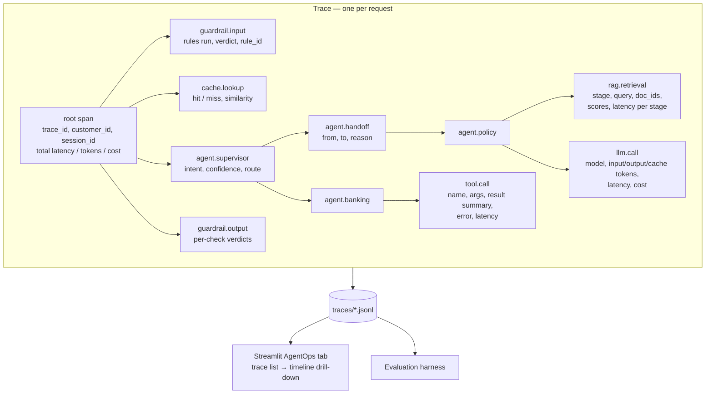

### 8.1 Span contract

Every span carries `span_id`, `parent_span_id`, `trace_id`, `type`, `name`,
`start_ts`, `duration_ms`, `status`, and a typed `attributes` payload. LLM spans
additionally carry `model`, `input_tokens`, `output_tokens`, `cache_read_tokens`, and
`cost_usd`. This is an OpenTelemetry-shaped model without the OpenTelemetry dependency —
JSONL on disk is enough for a single-process lab and is trivially inspectable, which is the
point.

### 8.2 Evaluation

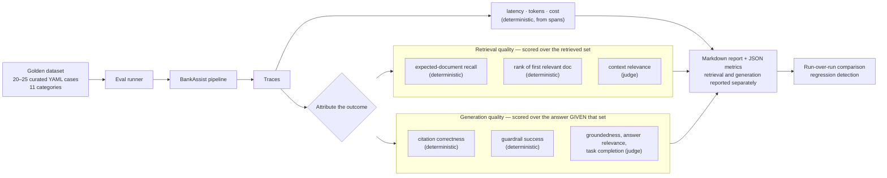

Two properties of this design matter more than the metric list:

**Retrieval and generation are scored separately** (FR-6.7a). A bad answer has two very
different causes — the right documents were not retrieved, or they were retrieved and the
model failed to use them — and a single blended score hides which. Retrieval metrics are
computed over the retrieved set; generation metrics are computed over the answer *given*
that set, so a generation failure is not blamed on retrieval or vice versa.

**Deterministic scorers are preferred wherever the question has a factual answer.**
Citation correctness, guardrail success, and expected-document recall are exact checks, not
judgements — using an LLM judge for them would add cost and variance for no information.
The judge is reserved for the four metrics that genuinely require reading comprehension,
and only there is the optional stronger model used.

The dataset is **20–25 curated cases, not volume**, covering: straightforward policy
retrieval, exact banking terminology, multi-turn / query rewrite, retrieval failure,
generation and grounding, citations, dispute workflows, PII, prompt injection, financial
advice, and out-of-domain. A case that does not distinguish a working system from a broken
one does not belong in the set.

Observability stays deliberately small: **JSONL traces plus a simple Streamlit view.** No
collector, no hosted platform, no distributed tracing — those are scaling notes (§12), not
lab work.

---

## 9. Cost optimization architecture

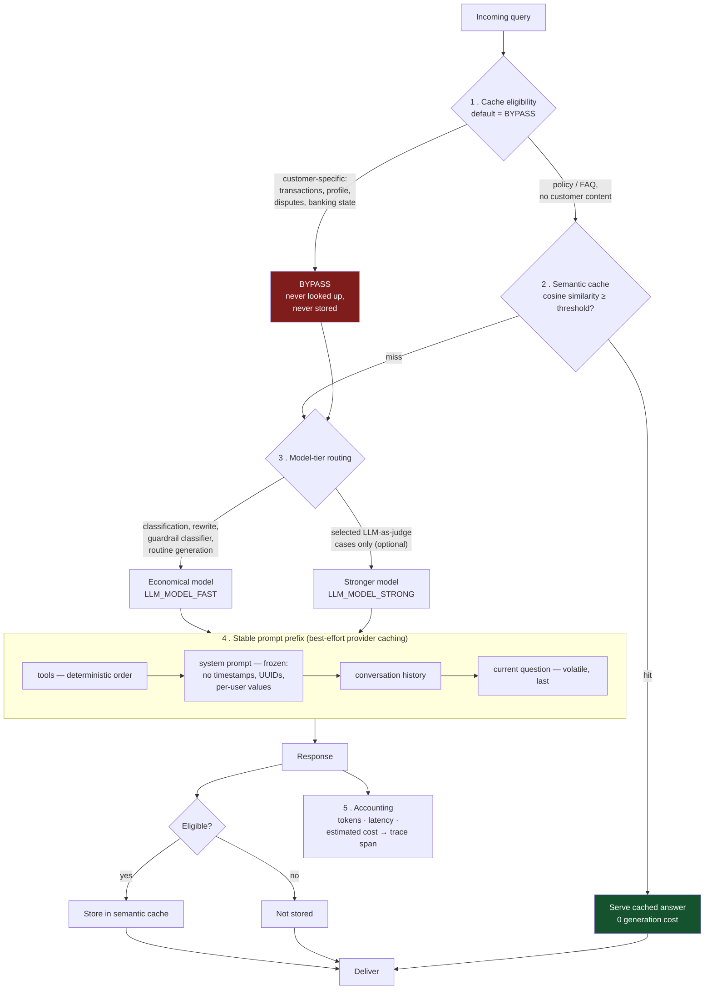

### 9.1 The measurable levers

The core of Lab 7 is deliberately **provider-independent**, so no lab outcome depends on
acquiring a second API credential.

| Lever | Mechanism | Measurable as |
|---|---|---|
| **Semantic caching** | Embed query → cosine similarity against stored eligible queries → serve on threshold. | Hit rate; generation calls avoided; latency and cost delta on a fixed workload. |
| **Model-tier routing** | Economical model for classification, rewriting, guardrail classification, and routine generation. Stronger model only for selected LLM-as-judge cases. | Per-call-type token and cost breakdown vs. a single-tier baseline. |
| **Token accounting** | Every LLM span records input and output tokens against the model that produced them. | Tokens per request type, aggregated from real spans. |
| **Latency measurement** | Every span is timed; the root span totals the request. | p50/p95 per request type, cached vs. uncached. |
| **Estimated cost comparison** | Pure function over the configurable price table. | Before/after table over a fixed 30-query workload. |
| **Provider prompt caching** *(best-effort)* | Keep the prefix byte-stable and let the provider cache it. | Reported **only where the provider exposes a measurable signal**; otherwise recorded as a documented finding. |

### 9.2 Cache eligibility — an explicit, defaulted-to-bypass decision

The semantic cache is the one component that can cause a *privacy* failure rather than
merely a wrong answer: serving customer A's cached transaction summary to customer B is a
data breach, not a cache miss. The design therefore makes eligibility an **explicit
decision on every request, defaulting to bypass**, rather than an exclusion rule that has
to remember every unsafe case.

| | Eligible | Bypass (default) |
|---|---|---|
| **Content** | Policy, product, FAQ, general banking education | Transactions, customer profiles, dispute cases, balances, any personalized banking state |
| **Signal** | Route is `policy` or `general` **and** no customer-scoped tool was invoked | Anything else, including unknown or unclassified routes |
| **Behaviour** | Looked up before generation; stored after | Never looked up, never stored |

Rules that follow from it:

- **Positive establishment.** Eligibility must be affirmatively determined. An unrecognized
  route is a bypass, not a cache.
- **Two-sided enforcement.** The check runs at lookup *and* at store. A request that turns
  out to have touched customer data mid-flight is not written to the cache even though it
  was eligible on entry.
- **No cross-customer key.** Eligible entries contain no customer identity by construction,
  because customer-scoped requests never reach the cache at all.
- **Output guardrails still run on hits.** A cached response is not a trusted response.
- **Entries expire**, so a policy update does not serve stale answers indefinitely.
- **The decision is traced** with its reason, so any cache hit can be audited afterwards.
- **Threshold failure mode is documented**: too low, and a near-miss question gets a
  confidently wrong answer — worse than a miss.

Recorded as [ADR-0006](../decisions/0006-semantic-cache-eligibility.md).

### 9.3 Prompt-prefix hygiene

Provider prompt caching is a **prefix match** — one changed byte invalidates everything
after it. The codebase rule holds regardless of provider, because it costs nothing and is
good hygiene anyway: no timestamps, request ids, UUIDs, per-user values, or
non-deterministically-serialized JSON in the system prompt or tool definitions; tools
serialized in sorted order; volatile content last.

Where the provider reports a cache signal, it is asserted and measured. Where it does not,
the prefix discipline still stands and the absence of a measurable signal is reported as a
finding rather than quietly dropped.

### 9.4 Cost accounting

Model prices live in one configurable table in `config.py`, keyed by model id. Every LLM
span computes:

```
cost = (billable_input_tokens × input_price_per_mtok
      + output_tokens         × output_price_per_mtok) / 1_000_000
```

`billable_input_tokens` is `input_tokens` minus any provider-reported cached-prefix tokens,
which are re-added at the provider's discounted rate when — and only when — the provider
reports them. Where no cache signal is available the term is simply zero, and the figure
remains a correct uncached cost.

Because it is one pure function over a configurable table, it is unit-testable to the cent.
The table ships with documented defaults that **must be verified against the provider's
current published pricing** before any cost figure is quoted in the submission; the Lab 7
before/after table is then generated from real recorded spans rather than estimated.

---

## 10. Security considerations

| Concern | Approach in this project | Production would additionally need |
|---|---|---|
| **Secrets** | Environment variables via a single settings module; `.env` git-ignored; `.env.example` holds names only. | Vault / KMS, rotation, no long-lived keys. |
| **Authentication** | Out of scope. `customer_id` is passed and trusted (stated assumption). | OIDC/SSO, session binding, step-up auth for disputes. |
| **Authorization** | Runtime-injected `customer_id` on every tool; the model cannot select whose data it reads. | Policy engine, per-field entitlements, audit of every access. |
| **Prompt injection (user)** | Layered input guardrails; rules then classifier. | Continuous red-teaming, injection corpus in CI. |
| **Prompt injection (retrieved content)** | Retrieved chunks wrapped in untrusted-data delimiters; system prompt asserts they are information, never instruction; instruction-shaped content is surfaced, not obeyed. | Content provenance, ingestion-time scanning, signed documents. |
| **PII exposure** | Card numbers masked at the data layer; output scanning for PAN/SSN/account patterns; no PII in traces or logs. | DLP, tokenization, field-level encryption, retention policy. |
| **Data minimization** | Tools return only the fields the agent needs; no bulk export tool exists. | Purpose limitation enforcement, consent records. |
| **Unauthorized financial operations** | Structurally prevented — no transfer, payment, or balance-mutation tool exists in the system. | Dual control, transaction limits, out-of-band confirmation. |
| **Supply chain** | Small, pinned, well-known dependency set; each addition needs an ADR. | SBOM, dependency scanning, signed builds. |
| **Auditability** | Every request produces a persisted trace with guardrail verdicts and tool calls. | Immutable audit log, retention, tamper evidence. |
| **Denial of wallet** | Bounded agent loops (max turns, max tool calls); cheap-model routing; caching. | Per-tenant quotas, rate limiting, spend alerts. |

Two honest disclaimers, stated because a governance project that overstates its own
guarantees has failed at its own subject:

1. **Guardrails are defence in depth, not proof.** A layered system with deterministic
   rules and a classifier raises the cost of an attack; it does not make injection
   impossible. The evaluation suite measures the guardrail success rate precisely so the
   residual failure rate is a published number rather than an assumption.
2. **No compliance claim is made.** This design discusses PCI-DSS, GDPR, and audit
   considerations. It does not implement them and must not be represented as compliant.

---

## 11. Key architectural trade-offs

| # | Decision | Chosen | Rejected alternative | Rationale | Cost of the choice |
|---|---|---|---|---|---|
| 1 | Deployment shape | Modular monolith | Microservices | Fits the time budget; keeps every layer demonstrable in one trace. | No independent scaling or deployment; boundaries enforced by convention and review, not by network. |
| 2 | Orchestration | Hand-written supervisor | LangGraph / CrewAI / AutoGen | Every hop visible and explainable; exact trace control; no large dependency. | We reimplement routing, loop bounds, and state; no ecosystem tooling. |
| 3 | Embeddings | OpenAI `text-embedding-3-small` (hosted) | Local `sentence-transformers` MiniLM | Lab 2 brief mandate; better retrieval quality than a 384-d local model ([ADR-0007](../decisions/0007-pinecone-and-api-embeddings.md)). | Paid, rate-limited, network-dependent — a second hosted dependency on the critical path. |
| 3a | Reranking (Lab 3 only) | Local `sentence-transformers` `CrossEncoder` (`ms-marco-MiniLM-L-6-v2`) | Hosted rerank API; LLM-based reranking | Lab 3 brief names this model; runs free, offline, deterministic, fast on CPU for 10 candidates ([ADR-0008](../decisions/0008-reranker-dependency.md)). | Reintroduces `torch`'s ~2.5 GB dependency tree, which ADR-0007 had specifically avoided. |
| 4 | Vector store | Pinecone (serverless, hosted) | ChromaDB / pgvector / Qdrant / FAISS | Lab 2 brief mandate; managed, no local persistence to manage ([ADR-0007](../decisions/0007-pinecone-and-api-embeddings.md)). | Paid credential and network round trip on every ingest and query; no offline demo. |
| 5 | Keyword search | `rank_bm25` in-process | Elasticsearch / OpenSearch | Two dependencies-free lines vs. a JVM service. | Index rebuilt at startup; fine at this corpus size, wrong at 10⁶ docs. |
| 6 | Guardrails | Custom deterministic controls (auth/RBAC/ownership/tool/HITL/redaction/masking) + NeMo Guardrails for AI-semantic input/output rails only ([ADR-0011](../decisions/0011-nemo-guardrails-for-ai-semantic-rails.md), supersedes row for that scope) | Guardrails AI; fully custom regex for injection/jailbreak | NeMo demonstrates an enterprise AI-semantic rail pattern; deterministic app-security controls stay ours so they never depend on a model's judgement. | Extra LLM call per guarded turn; NeMo's own dependency tree; own verdict shape normalized via `nemo_adapter.py` so nothing downstream depends on NeMo types. |
| 7 | Tracing | Custom JSONL tracer | OpenTelemetry + Jaeger / LangSmith / Phoenix | No account, no collector, no extra process; the file *is* the artifact. | No distributed tracing, no production-grade UI; we build the viewer. |
| 8 | Evaluation | Custom scorers + LLM-as-judge | RAGAS / DeepEval | Transparent metric definitions we can show in the write-up; no heavy dependency tree. | Metric implementations are ours to validate; no published benchmarks. |
| 9 | LLM provider | OpenAI (existing credential), behind `LLMClient` | Anthropic primary; direct SDK calls everywhere | No second credential becomes a project prerequisite. Lab 7's measurable core moves to semantic caching, tier routing, token accounting, latency, and cost — all provider-independent. | Provider-native prompt caching is less observable, so that part of Lab 7 is best-effort. Anthropic remains addable behind the same interface. |
| 13 | Model tier | Economical model as the default everywhere; stronger model optional, judge-only | Frontier model by default | Cost discipline; the labs grade architecture, not model horsepower. | Some tasks may need prompt iteration to work well on a small model. |
| 10 | Mock data store | SQLite | JSON files / Postgres | Real SQL exercises the tool layer honestly; zero setup; ships with Python. | None material at this scale. |
| 11 | UI | Streamlit | React SPA / plain HTML | Fastest path to a screenshot-worthy multi-tab demo (chat, traces, evals, cost). | Not a production UI; limited interaction model. |
| 12 | RAG mode retention | Keep basic *and* enterprise | Replace basic with enterprise | The Lab 2→3 comparison is a required deliverable, not an afterthought. | Slight extra code and a config switch. |

---

## 12. Deferred scaling notes

Recorded so the write-up's "recommendations for enterprise-scale adoption" section has a
foundation, and so the choices above are legibly *choices* rather than limits:

- **Retrieval at scale**: replace Chroma with pgvector or a managed vector DB; move BM25 to
  OpenSearch; precompute embeddings in a batch pipeline; add an ingestion service with
  document-level ACLs so retrieval is entitlement-aware.
- **Orchestration at scale**: the supervisor becomes a service; agent invocations become
  durable workflow steps so a failure mid-dispute is resumable rather than lost.
- **Guardrails at scale**: extract the engine into a shared policy service so every AI
  application in the estate inherits the same rules and the same audit trail; maintain the
  injection corpus as a continuously red-teamed asset.
- **Observability at scale**: emit OpenTelemetry spans to a real collector; the span model
  here was chosen to be shaped compatibly, so this is an exporter change rather than a
  rewrite.
- **Evaluation at scale**: run the golden set in CI on every PR, gate merges on regression
  thresholds, and grow the dataset from production traces that were flagged by guardrails.
- **Cost at scale**: per-tenant budgets and quotas, cache warming for known-hot policy
  questions, and a longer-TTL prompt cache for high-traffic prefixes.

---

## 13. Lab 5 — Guardrail & security architecture

Additive to every section above — no Lab 1–4 component is replaced. Two kinds of
control, deliberately not merged into one "guardrail" concept (ADR-0011):

- **AI-semantic rails** (NeMo Guardrails): fuzzy, LLM-judged — prompt injection,
  jailbreak, system-prompt extraction, semantic output safety.
- **Deterministic application security**: authentication (JWT, ADR-0010), RBAC
  (ADR-0010), customer ownership, tool authorization, HITL approval + replay
  protection, secret redaction, PII/financial-data masking. These hold even if NeMo is
  unavailable, wrong, or bypassed.

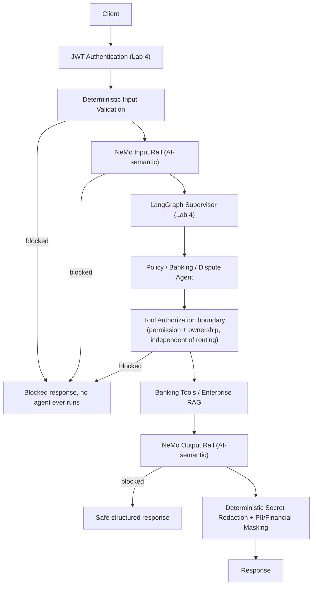

### HITL / financial-mutation path

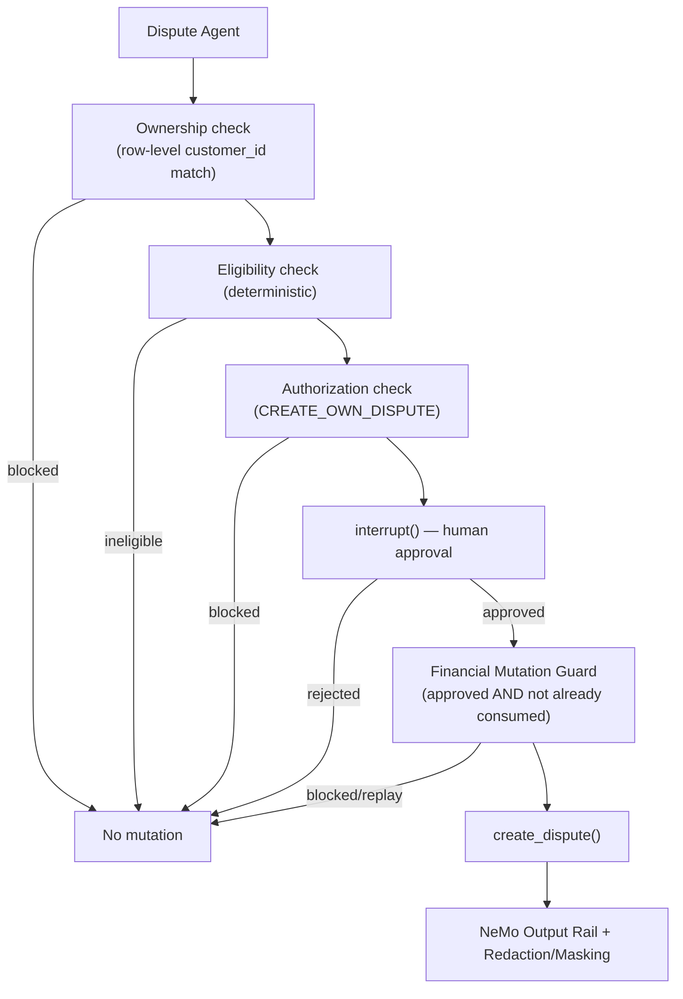

### Tool-call security boundary (lower-level)

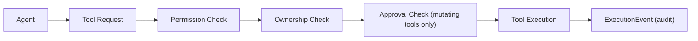

## 14. Lab 7 — Cost optimization architecture (ADR-0013)

Additive to every section above — Redis is introduced only as a caching layer; no
existing component's behavior changes when Redis is disabled or unreachable (the
default). Full design rationale: [ADR-0013](../decisions/0013-redis-caching-layer.md);
eligibility policy: [ADR-0006](../decisions/0006-semantic-cache-eligibility.md); planning
artifact: [`docs/plan/lab-07-cost-optimization-plan.md`](../plan/lab-07-cost-optimization-plan.md).

### Current architecture (Labs 1–6, for comparison)

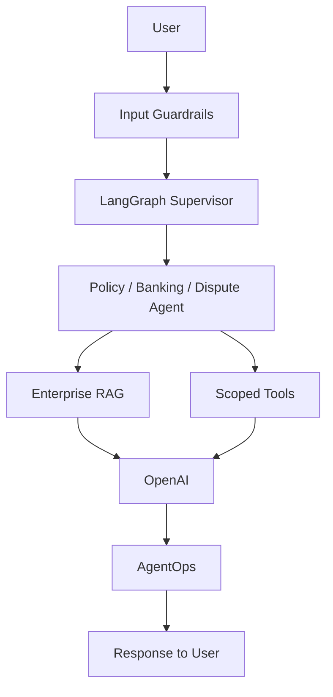

### Target (optimized) architecture

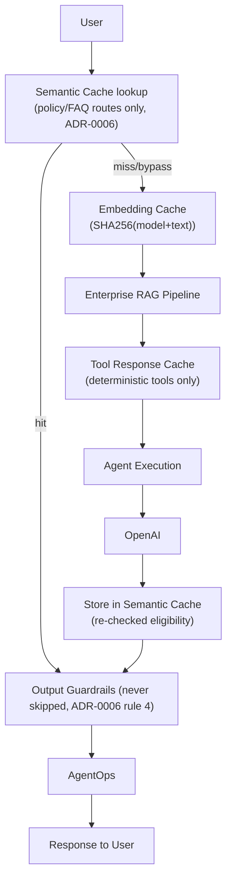

### Three caches, one Redis instance

| Cache | Key shape | TTL | Eligible content |
|---|---|---|---|
| Semantic response | `semantic:vec:{sha256(version+query)}` (hash), native RediSearch KNN | 24h | Policy/FAQ/KYC/card-terms/dispute-policy/general — `GLOBAL_CACHEABLE` only (ADR-0006/0013) |
| Embedding | `embedding:{version}:{sha256(model+"\0"+text)}` | 30d | Any embedded text — model bound into the hash |
| Tool response | `tool:{label}:{version}:{sha256(canonical_args)}` | 24h | Deterministic, non-customer tools on `TOOL_CACHE_ALLOWLIST` only |

Redis is reached only through `bankassist.caching.redis_client.build_redis_client`,
mirroring the "one module owns the SDK" convention already used for Pinecone
(`rag/vector_store.py`) and OpenAI (`rag/embeddings.py`). `REDIS_ENABLED=false` (the
default) or an unreachable Redis degrades every cache to a no-op — the app's
correctness never depends on Redis being up.
