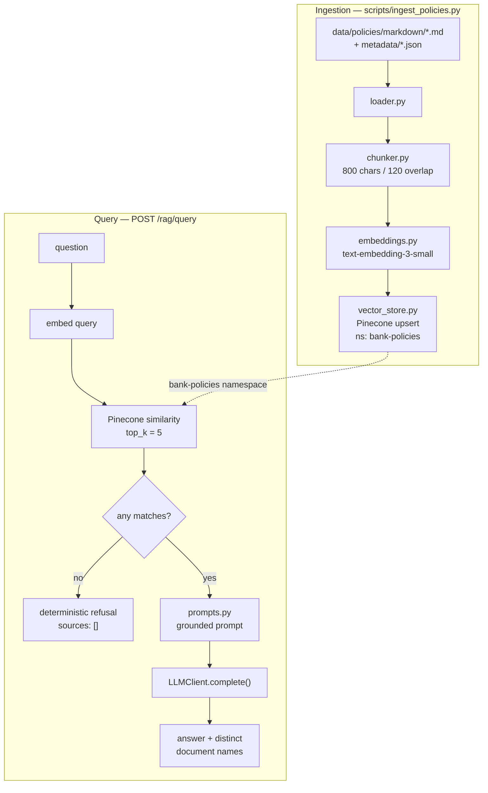

# Lab 2 — Basic Banking Policy RAG

## Problem statement

Lab 1 delivered a working application skeleton with no knowledge in it — a banking
assistant that could report it was alive and call a model, but had no policy content, no
way to find a relevant passage, and no way to show a user where an answer came from. Asked
a real policy question, it would answer from the model's parametric memory: confidently,
unverifiably, and possibly wrong. For a banking assistant that is the failure mode that
matters most.

## Objectives

A complete, demonstrable Retrieval-Augmented Generation pipeline over a real banking policy
corpus: Markdown policies → chunks → OpenAI embeddings → Pinecone → top-5 similarity search
→ grounded prompt → answer with source citations. "Solved" means a question asked through
the API or the Streamlit UI returns an answer composed only from retrieved policy text, and
a question the corpus does not cover returns an explicit refusal rather than an invention.

Full requirements: [`docs/requirements/lab-02-basic-rag.md`](../requirements/lab-02-basic-rag.md).

## Assumptions

- **The corpus is real, not synthetic.** Ten public documents from SBI Card and State Bank
  of India — cardholder agreement, dispute FAQ and form, KYC policy, debit card FAQ, forms
  index, credit card FAQ, internet/mobile banking guides, customer rights policy. No PII,
  no account or card numbers, but a real institution, which required amending CLAUDE.md §7
  (previously "all data is synthetic, no real institutions" — now split so that rule applies
  in full to *customer* data from Lab 4 onward, while the policy corpus is documented as
  real public material).
- The markdown is PDF-extracted, not hand-authored, and carries the artifacts of that: page
  banners, flattened tables, orphaned headings. It is used as-is — repairing it would be
  layout-aware parsing, which this lab excludes by name.
- Metadata comes from a JSON sidecar per document (`title`, `category`, `source`), not
  frontmatter — a better fit for the four required fields than what was originally planned.

## Architecture approach



`src/bankassist/rag/` holds nine modules along the dependency direction Lab 1 established:
`api → rag → {llm, tracing, config, logging, errors}`. Two protocols — `Embedder` and
`VectorStore` — each have a real adapter and an in-repo test double
(`OpenAIEmbedder`/`StubEmbedder`, `PineconeVectorStore`/`InMemoryVectorStore`), which is
what let the entire test suite run with no API key and no network.

## Key design decisions

- **Pinecone + `text-embedding-3-small` over ChromaDB + local MiniLM.** The Lab 2 brief
  mandates both and forbids `sentence-transformers`, overturning the approved technology
  stack. Recorded in
  [ADR-0007](../decisions/0007-pinecone-and-api-embeddings.md), approved at a Gate-3 scope
  check. Consequence flagged in the ADR: Lab 3's cross-encoder reranker now has no chosen
  implementation, since `sentence-transformers` is gone from the stack.
- **Character chunking, not token chunking.** The brief specifies 700–900 characters with
  100–150 overlap; the original plan specified 500/80 tokens. The brief won; settings are
  named `CHUNK_SIZE_CHARS` etc. so the unit can't be misread later.
- **Structural refusal detection, never prose interpretation.** Zero retrieved chunks
  refuses before any model call — there is nothing to be grounded in, so calling the model
  would only invite it to fall back on parametric knowledge. When chunks exist but the model
  still emits the exact refusal sentence, the source list is emptied. Both paths are
  deterministic and unit-tested; neither parses model text for meaning.
- **Vector ids are deterministic** (`<document-slug>#<chunk_index>`), so re-running
  ingestion **upserts in place**. Verified twice against the live index: `0 → 190`, then
  `190 → 190` on the immediate re-run.
- **The corpus is real public material, not synthetic.** This required amending CLAUDE.md
  §7 rather than silently ignoring the conflict — the rule now distinguishes the policy
  corpus (real, public, no PII) from customer data (synthetic, always, from Lab 4).

## Implementation strategy

Built in the order the milestone plan set out, each stopping for a screenshot before the
next started: environment and settings → corpus verification → loader/chunker → embeddings
→ Pinecone → retrieval → generation/API → Streamlit UI → self-review. Chunking and loading
were built and tested as pure functions before any network call was written, so the first
API call in the whole pipeline (embeddings) was made against code already known to be
correct up to that boundary.

## Validation approach

**187 tests pass, `ruff` clean, 96% coverage of the new `bankassist.rag` package and the
`/rag/query` route.** Every OpenAI and Pinecone call in the test suite goes through a fake
SDK client or an in-repo double (`StubEmbedder`, `InMemoryVectorStore`, `StubLLMClient`) —
no test spends money or needs a network connection (NFR-L2-2), verified directly by running
the suite with `OPENAI_API_KEY` and `PINECONE_API_KEY` unset.

| Layer | File | What it asserts |
|---|---|---|
| Chunking | `test_rag_chunker.py` | size window, overlap, determinism, hard-cut on unbreakable text, span/text audit trail |
| Loading | `test_rag_loader.py` | metadata extraction, missing sidecar/key errors, whitespace normalization |
| Ingestion | `test_rag_ingest.py` | idempotent upsert-by-id, vector/metadata mapping, mismatched-count rejection |
| Embeddings | `test_rag_embeddings.py` | batching, out-of-order response repair, wrapped SDK errors |
| Vector store | `test_rag_vector_store.py` | index creation/readiness, upsert batching, query mapping, wrapped SDK errors |
| Pipeline | `test_rag_pipeline.py` | top-k, ordering, zero-match and model-emitted refusal, distinct sources |
| Prompts | `test_rag_prompts.py` | grounding instruction, untrusted-content framing, chunk labelling and order |
| API | `test_rag_api.py` | request shape, validation, trace id, error envelope, lazy pipeline construction |

Real end-to-end runs against the live OpenAI and Pinecone accounts: full ingestion (190
chunks, 10 documents), a second idempotent ingestion, retrieval for all three required demo
questions, and all three questions answered through both `POST /rag/query` and the Streamlit
UI.

## Screenshots and outputs

Captured at each milestone (see the session's screenshots): the `data/policies/` folder
(markdown/metadata/pdf); the chunk-generation summary (190 chunks, 254–898 chars, median
801); embedding generation logging `text-embedding-3-small` and 1536 dimensions; the
Pinecone console showing 190 records in namespace `bank-policies`; retrieval logs with
per-result similarity scores; the pipeline answering end to end via both the CLI and
`POST /rag/query`; the Streamlit UI; and all three required demo queries answered correctly
with correct source citations.

## Code and configuration snippets

**Deterministic vector id** (`src/bankassist/rag/models.py`) — what makes re-ingestion an
upsert instead of a duplicate:

```python
@property
def vector_id(self) -> str:
    return f"{_slug(self.metadata.document)}#{self.chunk_index}"
```

**Structural refusal** (`src/bankassist/rag/pipeline.py`) — zero results never reach the
model, and a model-emitted refusal is matched exactly, never interpreted:

```python
if not chunks:
    return self._log_answer(question, self._refusal(chunks=[]), started)
...
if text == REFUSAL:
    return self._log_answer(question, self._refusal(chunks=chunks), started)
```

**Chunk settings validated at startup** (`src/bankassist/config.py`) — an overlap at or
above the minimum chunk size would silently infinite-loop the chunker; this fails loudly
instead:

```python
if self.chunk_overlap_chars >= self.chunk_min_chars:
    raise ConfigurationError(
        "CHUNK_OVERLAP_CHARS must be smaller than CHUNK_MIN_CHARS, or chunking "
        f"cannot advance. Got overlap={self.chunk_overlap_chars}, "
        f"min={self.chunk_min_chars}.",
        ...
    )
```

## Observations from implementation

- **The corpus was supplied mid-plan, not authored to spec.** The original spec assumed 12
  synthetic documents with YAML frontmatter; what arrived was 10 real public documents with
  JSON sidecars in three parallel directories. The spec was rewritten to match reality
  (§6 of the requirements doc records every point of divergence) rather than the corpus
  being reshaped to match an earlier assumption.
- **Retrieval recovered from noisy extraction better than expected.** The PDF-to-Markdown
  conversion split the chargeback time-limit table (90/90/30/75 days) across disconnected
  lines, away from the network names they belong to — flagged as a real risk after M1. In
  practice the model reassembled the full, correctly-attributed table from fragments spread
  across two documents.
- **A genuine over-refusal surfaced live, not in a test.** The KYC demo question failed on
  first run: retrieval put the complete answer (all six OVD types) at rank 5, but the model
  refused anyway. Root cause was the system prompt's strictness — it implicitly expected
  excerpts to read like direct FAQ answers, and this corpus's dense legal prose didn't
  qualify in the model's judgement. Fixed by explicitly permitting synthesis across
  fragments, re-verified live, and the one test whose *wording* assertion changed was
  updated to match — not weakened.
- **`vector_store.py` initially had no dedicated unit tests.** It was exercised live and
  through the `InMemoryVectorStore` double via the pipeline, but the Pinecone adapter code
  itself — SDK response parsing, batching, error wrapping — had no test of its own, unlike
  the OpenAI adapters. Caught during self-review by comparing coverage numbers (30% vs.
  93%+ elsewhere) rather than by a systematic check; added 20 tests against a fake SDK
  client before Gate 2.

## Challenges encountered

- **Two OpenAI keys, wrong one winning.** A stale service-account key was set at both User
  and Machine environment-variable scope on the development machine, silently shadowing the
  correct key in `.env` (pydantic-settings gives environment variables precedence). Every
  embedding call failed with 401 until diagnosed by comparing key prefixes/lengths across
  sources without ever printing either key.
- **A background process died silently mid-session**, taking the API server down between
  verification and screenshot capture with no crash trace in its log — most likely killed by
  session/process cleanup outside the application. Resolved by restarting and verifying
  liveness before every subsequent capture, and recommending the user run both processes in
  terminals they control directly for the remaining screenshots.
- **An external corpus-building tool silently mutated the repository.** Building
  `data/policies/` from `BankAssist_Banking_Knowledge_Base.zip` also appended `data/*` and
  `docs/*` to `.gitignore` and deleted `.env.example`, discovered only during the Gate-2
  self-review by noticing `git status` didn't show the corpus or the just-approved Lab 2
  spec/ADR as untracked files at all. `.env.example` was reconstructed from git history plus
  the session's known edits; the `.gitignore` lines were confirmed with the user before
  removal, since they touch what becomes part of the committed project.

## Trade-offs considered

- **Real corpus over synthetic.** Gains authentic retrieval and generation evidence — a
  genuine over-refusal was caught and fixed, which a hand-authored corpus tuned to work
  might never have surfaced. Costs a CLAUDE.md amendment and an explicit no-PII/no-real-
  institution-beyond-source check that a synthetic corpus wouldn't need.
- **Pinecone + API embeddings over local Chroma + MiniLM** (ADR-0007). Gains brief
  compliance and a managed-vector-database demonstration; costs a second credential, network
  dependence for every query, and an unresolved reranking approach for Lab 3.
- **Fixing the over-refusal live rather than reporting it as a known limitation.** The
  alternative — leaving the KYC demo query broken and noting it as a finding — would have
  been honest but would have left one of three required deliverable screenshots unusable.
  Chose to diagnose and fix the general prompt weakness (not hand-tune for this one query),
  and re-verified all three questions afterward to confirm no regression.

## Lessons learned

- **Chunk boundaries and retrieval can both be exactly correct, and generation can still
  fail.** The instinct when an answer is wrong is to suspect retrieval first; here retrieval
  was perfect and the fix was entirely in the system prompt. Separating retrieval-quality
  evidence from generation-quality evidence (which the project's Lab 6 design already
  planned to do) would have made this diagnosis faster — worth confirming that distinction
  again when Lab 6 lands.
- **Coverage percentage caught an architecture gap that manual review didn't.** Two adapter
  modules with the same shape (`OpenAIEmbedder`, `PineconeVectorStore`) got very different
  test treatment because one was built with a fake-SDK test file in mind from the start and
  the other wasn't. A coverage delta made the asymmetry obvious in a way that re-reading the
  code hadn't.
- **A supplied corpus is a spec input, not a spec violation.** Rewriting the requirements
  document to match what was actually delivered — rather than forcing the delivered corpus
  to match an earlier guess — kept the spec honest and made every later divergence (JSON
  sidecars vs. frontmatter, real institution vs. synthetic, PDF noise) a recorded decision
  instead of a silent one.
- **Environment and git hygiene deserve the same scrutiny as application code.** Two of the
  most consequential problems this lab surfaced — the shadowed API key and the `.gitignore`
  mutation — were entirely outside the application logic, and neither would have been caught
  by `pytest` or `ruff`. The self-review checklist's habit of running `git status` and
  `git diff` before reporting completion is what caught the second one.

## Security, governance, scalability, operational and cost considerations

- **Security.** No secret appears in any diff, log, or trace (verified by grep against every
  new file). `.env` is confirmed untracked. Retrieved chunks are wrapped in delimited
  `<document>` blocks with an explicit "information, not instruction" system-prompt
  statement — prompt hygiene only; no detection or verdict engine exists yet (that's Lab 5).
- **Governance.** The corpus's real-institution status is now explicit in CLAUDE.md rather
  than contradicting it silently. The third-party provenance of `data/policies/` (and
  whether it should ultimately be redistributed in a public repo) is recorded as an open
  decision for the user at the Git approval gate, not assumed.
- **Scalability.** Ten documents and 190 chunks is nowhere near Pinecone's serverless
  limits. The real constraint at this scale is embedding-call latency (a few seconds per
  ingestion run) and Pinecone's index-readiness wait (up to ~60s on cold creation) — both
  already handled (batching, polling) rather than assumed away.
- **Operational.** Ingestion is a manual CLI step, not a scheduled job — appropriate for a
  10-document corpus that changes rarely, not for a production policy set that updates
  weekly. No embedding cache exists yet, so a full re-ingestion re-embeds every chunk even
  when only one document changed; explicitly deferred per the brief.
- **Cost.** Full ingestion embeds ~190 chunks (~150K tokens) at `text-embedding-3-small`
  pricing — well under a cent, verified against the configured price table. Each query adds
  one embedding call plus one chat completion; no caching exists yet (Lab 7).

## Recommendations for enterprise-scale adoption

- Add metadata filtering and hybrid (dense + BM25) retrieval before this corpus grows past a
  few hundred documents — pure vector similarity degrades as topically-similar-but-wrong
  documents accumulate. This is exactly Lab 3's scope.
- Replace the CLI-driven ingestion with a document-change-triggered pipeline (webhook or
  scheduled diff) once the corpus is sourced from a live policy management system rather
  than a one-time PDF conversion.
- Add layout-aware extraction (real table parsing, not flattened rows) before relying on
  this pipeline for documents with dense tabular data — the chargeback time-limit table is
  the concrete example already surfaced by this lab.
- Introduce per-tenant or per-jurisdiction namespaces in Pinecone before this pattern serves
  more than one bank's policy set, so retrieval scoping is structural rather than
  convention-based.
