# Implementation Plan

**Status:** Approved with amendments — **Lab 1 authorized; Labs 2–7 not yet authorized**
**Version:** 0.2
**Date:** 2026-08-03

> **Amendment log — v0.2.** OpenAI is the initial provider using the existing credential.
> Economical models are the default; a stronger model is optional and judge-only. Guardrails
> are explicitly split deterministic-vs-classifier. The semantic cache gains an explicit
> eligibility/bypass decision ([ADR-0006](../decisions/0006-semantic-cache-eligibility.md)).
> Lab 3 is retained as planned, with basic RAG kept for comparison. Lab 6 drops to 20–25
> curated evaluation cases and separates retrieval quality from generation quality;
> observability stays JSONL + a simple Streamlit view. Scope discipline is now an explicit
> standing constraint (see the bottom of this document).

Seven stages, aligned to the seven labs. Each stage is independently demonstrable and
leaves the system in a working state — there is no stage whose failure strands the project
with nothing to show.

**Total estimate: ~20 hours of focused work across 2–3 days.**

---

## Sequencing

```mermaid
gantt
    title BankAssist AI — lab sequencing
    dateFormat X
    axisFormat %s

    section Day 1
    Lab 1 · AI-assisted delivery      :done, l1, 0, 2
    Lab 2 · Basic RAG                 :l2, after l1, 3
    Lab 3 · Enterprise RAG            :l3, after l2, 4

    section Day 2
    Lab 4 · Multi-agent               :l4, after l3, 4
    Lab 5 · Guardrails                :l5, after l4, 4

    section Day 3
    Lab 6 · AgentOps + evaluation     :l6, after l5, 4
    Lab 7 · Cost optimization         :l7, after l6, 3
    Submission document               :sub, after l7, 2
```

Two dependencies are hard: **Lab 3 must precede Lab 4** (the Policy Agent uses the
enterprise pipeline), and **Lab 6's tracer must be threaded through as each layer is
built**, not retrofitted. The tracer interface is therefore introduced in Lab 2 as a
no-op stub and given a real implementation in Lab 6 — every layer calls it from day one.

---

## Lab 1 — AI-Assisted Software Delivery

**Objective:** Establish a spec-first, human-gated engineering workflow, and prove it by
shipping the **minimum meaningful application foundation** through the complete cycle —
specification → design → human approval → code → tests → validation → self-review → human
approval → branch/commit/push → PR.

**Estimated effort:** ~4 h

### Part A — planning artifacts

| Artifact | Status |
|---|---|
| `CLAUDE.md` | ✅ |
| `.claude/skills/{feature-development,testing,code-review}` | ✅ |
| `docs/requirements/project-requirements.md` | ✅ v0.2 |
| `docs/architecture/architecture.md` | ✅ v0.2 |
| `docs/architecture/technology-stack.md` | ✅ v0.2 |
| `docs/plan/implementation-plan.md` | ✅ v0.2 |
| `docs/decisions/` ADRs 0001–0006 | ✅ |
| `.gitignore`, `.env.example`, `README.md` | ✅ |

### Part B — application foundation

The smallest codebase that proves the workflow and gives Labs 2–7 their seams. Every
component here is a **seam other labs plug into**, which is what keeps it from being
throwaway scaffolding.

| Component | Why it belongs in Lab 1 |
|---|---|
| `docs/requirements/lab-01-foundation.md` | The spec that gates the code |
| Python project structure, `requirements.txt`, `pyproject.toml` | Everything else needs somewhere to live |
| `config.py` — typed settings, model tiers, price table | Read once, validated at startup; Lab 7 costs come from here |
| `logging_config.py` — structured JSON logging | Must exist before there is anything to log |
| `errors.py` — exception hierarchy | Error handling is a Definition-of-Done item, not a later retrofit |
| FastAPI app + `/health` | The HTTP surface every later lab extends |
| `LLMClient` interface + OpenAI adapter + stub | The single provider chokepoint (ADR-0005). The stub is what lets every later lab test without a key |
| `Tracer` interface + span model + in-memory impl | Labs 6 and 7 depend on this existing from the start (see the risk register) |
| Tests + `ruff` + `pytest` config | The quality gates the workflow claims to run |

**Explicitly not in Lab 1:** RAG, embeddings, Chroma, BM25, agents, dispute tools,
guardrails beyond foundational interfaces, semantic caching, evaluation.

### Exit criteria
- AC-1.1, AC-1.2, AC-1.3 satisfied — the foundation is the feature that traverses the whole
  workflow.
- `pytest` green, `ruff` clean, `/health` returns 200.
- A PR against `main` exists — **only after** human approval at Gate 2.

### Evidence to capture
The docs tree and skill files; the approval-gate exchange in the session; the test run and
lint output; `/health` responding and the FastAPI `/docs` page; the branch, commit, and PR.
A reflection on what the gated workflow caught that ad-hoc prompting would not have.

---

## Lab 2 — Basic RAG Pipeline

**Objective:** Documents → chunks → embeddings → vector store → similarity search → LLM →
grounded, cited answer.

**Estimated effort:** ~3 h

### Steps

1. **Environment verification** *(before any code)* — create the venv, install
   `requirements.txt`, confirm `chromadb` installs on Python 3.13, download the MiniLM
   embedding model. This is the risk checkpoint from the technology-stack doc; resolve it
   before building on top of it.
2. **Synthetic policy corpus** — `data/policies/*.md`, 10–15 documents: credit card terms,
   APR and interest, fees schedule, dispute and chargeback policy, fraud liability,
   account types, overdraft, statements and billing cycles, rewards, card replacement,
   general banking glossary. Each carries frontmatter: `doc_id`, `title`, `category`,
   `product`, `effective_date`.
3. *(Done in Lab 1)* Settings module — extend `src/bankassist/config.py` with retrieval
   settings only. Nothing else reads the environment.
4. *(Moved to Lab 1)* `LLMClient` interface + OpenAI adapter — `src/bankassist/llm/`.
   Records model, tokens, and latency on every call from the start.
5. *(Done in Lab 1)* Tracer — the span interface and in-memory implementation already exist;
   Lab 2 simply calls it from the ingestion and retrieval paths. Persistence lands in Lab 6.
6. **Chunker** — heading-aware Markdown splitting, ~500 tokens, ~80 overlap, metadata
   preserved.
7. **Ingestion script** — `scripts/ingest.py`: corpus → chunks → embeddings → persistent
   Chroma collection. Idempotent; reports chunk counts.
8. **Basic retriever** — embed query, top-*k* similarity search, return chunks with scores.
9. **Grounded generation** — a prompt that answers *only* from context, cites `doc_id`, and
   says "I don't have information on that" when context is empty or irrelevant.
10. **Minimal API + UI** — `POST /chat` and a single-tab Streamlit chat.
11. **Tests** — chunking boundaries, metadata preservation, ingest→query round-trip,
    retrieval quality on a fixed question set, the no-answer path, and citation presence.

### Exit criteria
AC-2.1 – AC-2.4. `pytest` green, `ruff` clean.
**This is the feature that completes AC-1.3** — it goes through spec → design → plan →
approval → implement → test → self-review → approval → PR.

### Evidence
Ingestion output with chunk counts, a screenshot of a cited answer, a screenshot of the
correct "I don't know" refusal, and a retrieval-quality table for the fixed question set.

---

## Lab 3 — Enterprise Multi-Stage RAG

**Objective:** Query classification → query rewrite where required → dense retrieval + BM25
→ Reciprocal Rank Fusion → metadata filtering → cross-encoder reranking → context
construction → generation → citation validation.

**Retained unchanged at the approval gate**, including the requirement that Lab 2's basic
RAG mode remains selectable so a Basic vs Enterprise comparison can be demonstrated (FR-3.8).

**Estimated effort:** ~4 h

### Steps

1. **`RetrievalPipeline` protocol** — extract the interface; make `basic` and `enterprise`
   selectable by config. Lab 2's pipeline survives as `basic` (FR-3.8).
2. **Query classifier** — economical-tier structured call returning one of policy / account /
   dispute / general / out-of-domain, plus a deterministic keyword fallback so routing is
   testable offline.
3. **Query rewriter** — pronoun resolution against history, banking-abbreviation expansion
   (APR, ATM, ACH, POS), optional multi-query variants.
4. **BM25 index** — build from the same chunks at startup; `rank_bm25` BM25Okapi.
5. **Hybrid retrieval + RRF fusion** — dense top-20 and sparse top-20, fused with
   reciprocal rank fusion (k=60). Pure function, directly unit-tested.
6. **Metadata filtering** — category, product, and effective-date filters applied
   post-fusion.
7. **Cross-encoder reranker** — `ms-marco-MiniLM-L-6-v2` over the fused candidates, top-5.
8. **Context builder** — token-budgeted assembly with `tiktoken`, dedup, per-chunk source
   ids attached.
9. **Citation validation** — deterministic check that every emitted `[doc_id#chunk]`
   resolves to a chunk retrieved for *this* request.
10. **Stage-level tracing** — each of the six stages emits a span with its own latency and
    intermediate output. This is what makes the pipeline demonstrable rather than assertable.
11. **Comparison harness** — `scripts/compare_retrieval.py`: run a query set through both
    modes, output a side-by-side table.
12. **Tests** — RRF maths, filter narrowing, rerank ordering and truncation, citation
    resolution (including a deliberately fabricated citation), classifier routing,
    rewriter behaviour.

### Exit criteria
AC-3.1 – AC-3.5. Specifically: a keyword-exact query that basic mode misses and hybrid mode
retrieves, with both results recorded.

### Evidence
The stage-by-stage trace of one query; the basic-vs-enterprise comparison table; a
before/after reranking ordering for a query set; a screenshot of a cited answer with the
citation-validation result.

---

## Lab 4 — Multi-Agent Orchestration

**Objective:** Supervisor routes to Policy, Banking, and Dispute agents; agents use scoped
tools; handoffs are traced.

**Estimated effort:** ~4 h

### Steps

1. **Mock banking database** — `scripts/seed_db.py`: deterministic (fixed seed) SQLite with
   ~5 customers, ~8 accounts, ~10 cards, ~200 transactions, ~5 dispute cases. Card numbers
   are non-Luhn test values, stored masked.
2. **Tool layer** — `src/bankassist/tools/`: `get_customer_profile`,
   `get_customer_transactions`, `get_transaction`, `create_dispute_case`,
   `get_dispute_status`. Each has a strict JSON schema and a description that states *when*
   to call it. **`customer_id` is injected by the runtime, never supplied by the model.**
3. **Agent base** — bounded tool-calling loop (max 5 turns, max tool-call budget), tracing
   on every turn, graceful partial answer on exhaustion.
4. **Policy agent** — wraps the Lab 3 enterprise pipeline.
5. **Banking agent** — account, balance, and transaction questions via the tools.
6. **Dispute agent** — the multi-step flow: identify transaction → check eligibility
   against dispute policy (via RAG) → collect reason → create case → return case id.
7. **Supervisor** — intent classification, single-agent routing, multi-agent fan-out, and
   synthesis of multiple specialist answers.
8. **Handoff tracing** — from-agent, to-agent, and the reason for every handoff.
9. **API/UI wiring** — surface which agents ran, and the tool calls they made.
10. **Tests** — routing across a labelled intent set; **cross-customer scoping** (customer A
    can never retrieve customer B's rows); tool schema validation; loop-bound enforcement;
    the end-to-end dispute flow; multi-agent synthesis.

### Exit criteria
AC-4.1 – AC-4.5. The cross-customer scoping test is non-negotiable and lands here, not in
Lab 5 — it is a structural property, not a guardrail.

### Evidence
A routing table over the intent set; the full dispute-flow transcript ending in a case id;
a trace screenshot showing supervisor → agent → tool nesting; a multi-domain query answered
by two agents.

---

## Lab 5 — Enterprise Guardrails

**Objective:** Input, financial-safety, tool, output, and RAG guardrails, all traced.

**Estimated effort:** ~4 h

### Steps

1. **Guardrail engine** — ordered check pipeline, typed `GuardrailVerdict`
   (`rule_id`, `decision`, `severity`, `rationale`, `matched_span`), short-circuit on block,
   every verdict traced.
2. **Deterministic input rules** — regex for injection markers, delimiter injection,
   role-override phrasing, and PAN / SSN / CVV patterns.
3. **LLM input classifier** — economical-tier, and **only** for what deterministic rules
   cannot decide: jailbreak framings, out-of-domain, financial-advice intent. Everything
   pattern-decidable (PII, banking identifiers, malformed/oversized input, literal injection
   markers) stays in step 2 as a deterministic rule.
4. **Financial-safety classifier** — the allow/restrict boundary from the architecture doc.
   Built alongside its test corpus, not after it: an allow-set and a block-set of ~15 cases
   each, with over-blocking treated as failure.
5. **Tool guardrails** — formalize what Lab 4 built structurally: schema validation,
   runtime-injected `customer_id`, precondition check plus mandatory trace record on
   `create_dispute_case`, and an explicit test asserting no money-movement tool exists.
6. **RAG guardrails** — wrap retrieved chunks in untrusted-data delimiters; system prompt
   asserts they are information, never instruction; instruction-shaped content is detected
   and surfaced, not obeyed.
7. **Output guardrails** — PII/PAN/account-number scan with redaction; personalized-advice
   scan; unsupported-claim flagging; grounding check against context; citation resolution.
8. **Attack corpus** — `data/attacks/*.yaml`: injection, jailbreak, PII-extraction,
   out-of-domain, and financial-advice cases, with expected verdicts.
9. **UI surface** — show fired guardrails and their rule ids on each response.
10. **Tests** — every guardrail gets a must-block **and** a must-allow case; a poisoned
    policy document that must not change behaviour; an unmasked PAN in a synthetic response
    that must be caught.

### Exit criteria
AC-5.1 – AC-5.8. Over-blocking counts as a failure, not a safe default.

### Evidence
The attack corpus with per-case verdicts; the allow/restrict comparison table; a trace of a
blocked request showing which rule fired; the poisoned-document experiment with its result.

---

## Lab 6 — AgentOps and Automated Evaluation

**Objective:** Full tracing, a trace viewer, a golden dataset, automated scoring, and
regression detection.

**Estimated effort:** ~4 h

### Steps

1. **Real tracer implementation** — replace the Lab 2 stub. Span tree with
   `span_id`/`parent_span_id`, timing, status, typed attributes; JSONL persistence per trace.
2. **Complete instrumentation audit** — walk every layer and confirm the span types from
   FR-6.2 are emitted with their required attributes. A missing span is a missing
   deliverable.
3. **Cost accounting** — pure function over the price table; attached to every LLM span.
4. **Trace viewer** — a *simple* Streamlit tab: trace list, drill-down timeline, per-span
   attributes, retrieved documents with scores, guardrail verdicts. Deliberately plain —
   JSONL plus this view is the whole observability story (NFR-13). No collector, no hosted
   platform, no distributed tracing.
5. **Golden dataset** — `evaluation/golden/*.yaml`, **20–25 curated cases**, quality over
   volume, covering: straightforward policy retrieval, exact banking terminology,
   multi-turn / query rewrite, retrieval failure, generation and grounding, citations,
   dispute workflows, PII, prompt injection, financial advice, out-of-domain. Each case
   carries the question, expected behaviour, expected source documents, and expected
   verdict. A case that would not distinguish a working system from a broken one does not
   go in.
6. **Retrieval-quality scorers** — expected-document recall and rank-of-first-relevant
   (deterministic), plus context relevance (judge). Scored over the **retrieved set**.
7. **Generation-quality scorers** — citation correctness and guardrail success
   (deterministic), plus groundedness, answer relevance, and task completion (judge).
   Scored over the **answer given that set**, so a generation failure is never blamed on
   retrieval or vice versa (FR-6.7a). The optional stronger model is used here and nowhere
   else.
8. **Eval runner** — `scripts/run_eval.py` → `evaluation/reports/<timestamp>.md` plus a
   JSON metrics file, **reporting retrieval and generation quality as separate figures**.
9. **Regression comparison** — compare two runs; flag any metric below its recorded
   threshold.
10. **Tests** — span nesting correctness, required attributes present, cost maths exact to
    the cent, scorer behaviour on known-good and known-bad fixtures.

### Exit criteria
AC-6.1 – AC-6.6, including detecting a **deliberately introduced** regression — for example,
disabling the reranker and watching context relevance and citation correctness drop.

### Evidence
A full trace timeline screenshot; the evaluation report; the run-over-run comparison showing
the injected regression being caught; the cost breakdown per request type.

---

## Lab 7 — Cost Optimization

**Objective:** Prompt caching, semantic caching, cache observability, and a measured
before/after comparison.

**Estimated effort:** ~3 h

### Steps

1. **Cache eligibility decision** — implement the explicit, defaults-to-bypass eligibility
   check from [ADR-0006](../decisions/0006-semantic-cache-eligibility.md). It runs **twice**:
   before lookup (on the classified route) and before store (on what the request actually
   did). Unknown routes bypass. This lands **before** the cache itself, so there is never a
   moment where an unguarded cache exists.
2. **Semantic cache** — embed the query with the already-loaded MiniLM model, cosine
   similarity against a SQLite store, threshold 0.92, TTL-based expiry. Output guardrails
   still run on hits.
3. **Model-tier routing** — economical model for classification, rewriting, guardrail
   classification, and routine generation; stronger model only for selected LLM-as-judge
   cases. Explicit and configuration-driven.
4. **Token and latency accounting** — confirm every LLM span carries input/output tokens,
   model id, and duration; the root span totals the request.
5. **Cost estimation** — pure function over the configurable price table. Verify the table
   against current published pricing before quoting any figure.
6. **Cache observability** — cache spans recording hit / miss / **bypass with reason**;
   hit-rate counters in the UI.
7. **Prompt-prefix audit** *(best-effort lever)* — verify the system prompt and tool
   definitions are byte-stable: no timestamps, UUIDs, request ids, per-user values, or
   non-deterministic JSON ordering. Then measure the provider's cache effect **if it exposes
   a signal**; if it does not, record that as a documented finding. The prefix discipline
   stands either way — it costs nothing and is good hygiene.
8. **Benchmark** — `scripts/benchmark_cost.py`: a fixed 30-query workload run with all
   optimizations off, then on. Output tokens, latency, and cost for each, from real
   recorded spans rather than estimates.
9. **Cost dashboard** — Streamlit tab: cost per request type, cache hit rate, cumulative
   spend, before/after comparison.
10. **Tests** — cache key determinism; near-duplicate hits and unrelated misses; the
    threshold boundary; **customer-specific requests never stored and never served**, and
    an unknown route bypassing by default (these are governance tests, not performance ones,
    and may not be weakened); cost maths exact to the cent.

### Exit criteria
AC-7.1 – AC-7.5, with the reduction quantified rather than claimed.

### Evidence
The before/after table (tokens, latency, estimated cost); a semantic-cache hit on a
paraphrased question; a trace showing a **bypass with its reason** for a customer-specific
request; the model-tier cost breakdown; the cost dashboard; the test proving
customer-specific content is never stored or served. Plus the prompt-caching finding —
measured effect, or a documented statement that no measurable signal was available.

---

## Submission document

**Estimated effort:** ~2 h

Assemble `docs/labs/lab-XX-*.md` into the single completion document the lab requires. Per
the lab brief, each lab section needs: problem statement, objectives, assumptions,
architecture approach, key design decisions, implementation strategy, validation approach,
screenshots, sample configuration and code snippets, observations, challenges encountered,
trade-offs considered, lessons learned, and recommendations for enterprise-scale adoption —
plus security, governance, scalability, operational, and cost considerations where relevant.

Grading weights are **lab completion 50%, technical implementation detail 35%, learnings
15%**, so the learnings sections are worth writing as the work happens, not reconstructed
at the end. Capture observations into `docs/labs/` at the close of each lab while the
friction is still fresh.

---

## Standing scope discipline

The priority is **all seven labs completed with strong evidence in 2–3 days**. Depth is cut
before breadth. Applies to every lab, not just the ones under time pressure:

**Do not build:** abstractions with one implementation; production infrastructure;
distributed tracing systems; hosted observability platforms; elaborate UI; framework
experiments; or any feature no lab objective needs.

**The test:** if a thing is not evidence for a lab objective, it is scope creep. Note it in
the change report as a suggestion and move on.

## Scope-cut order

If time runs short, cut in this order. Every cut below preserves a complete, demonstrable
seven-lab story; cutting a whole lab does not.

1. Multi-query variant generation in the rewriter (Lab 3) — the pipeline stands without it.
2. Multi-agent fan-out and synthesis (Lab 4) — single-agent routing still demonstrates
   orchestration.
3. LLM-as-judge scorers (Lab 6) — deterministic metrics alone still produce a real report.
4. The cost dashboard UI (Lab 7) — the benchmark script output is sufficient evidence.
5. Streamlit polish everywhere — functional beats attractive for a screenshot.

**Never cut:** the guardrail must-allow tests (they are the point of Lab 5), the
cross-customer scoping test, the tracer instrumentation (Labs 6 and 7 both depend on it), or
the lab evidence capture.

---

## Risk register

| Risk | Mitigation |
|---|---|
| Provider prompt caching not measurably observable | Accepted by design — Lab 7's five other levers are provider-independent and carry the lab; the absence of a signal is reported as a finding |
| Configured model id unavailable on the account | Settings validate model ids at startup and fail loudly, naming the configured value |
| Small model underperforms on a classification task | Iterate the prompt first; the stronger model stays judge-only. If a task genuinely needs it, record that as a finding rather than silently upgrading the default tier |
| `chromadb` fails to install on Python 3.13 | Verified in the very first step of Lab 2; fall back to the 3.12 interpreter or a numpy+SQLite store |
| Tracer retrofitted too late, forcing rework across every layer | Tracer interface lands in Lab 2 as a stub; every layer calls it from the start |
| Guardrails over-block and the demo looks broken | Build the allow-set corpus *before* the classifier; treat over-blocking as a test failure |
| Prompt caching silently never fires | Assert `cache_read_input_tokens > 0`; the audit in step 1 is a prerequisite, not a cleanup |
| Evidence gathered at the end, from memory | Capture screenshots and observations at each lab's exit, not on day 3 |
| Scope creep across seven labs | The cut list above, plus per-lab exit criteria |
