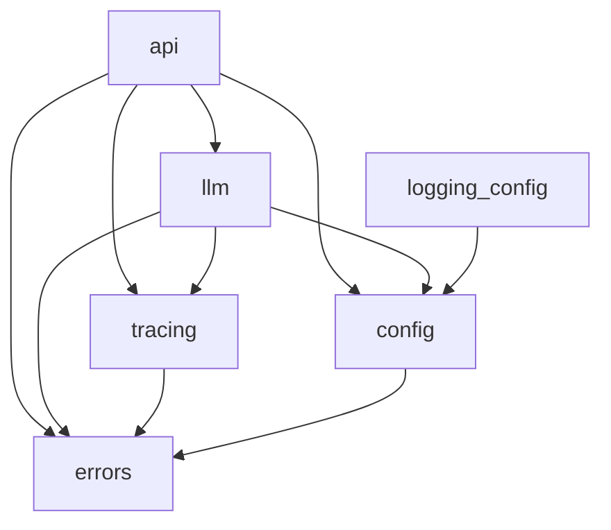

# Lab 1 — Application Foundation

**Status:** Implemented (2026-08-03) — v0.2, amended during implementation
**Feature slug:** `lab-01-foundation`
**Parent:** [`project-requirements.md`](project-requirements.md) AC-1.1 – AC-1.3

> **Amendment log — v0.2, made during implementation and reflected below.**
> 1. **Cost estimation removed from Lab 1.** The draft carried a `ModelPrice` table and a
>    `pricing.py`. Cost *optimization* is Lab 7 and was explicitly excluded from this cycle,
>    and the default price constants could not be verified. `LLMResponse` still reports
>    token counts and latency — those come free from the provider response.
> 2. **`NotFoundError` removed.** Nothing in Lab 1 raises it. The API's 404 comes from
>    Starlette's `HTTPException`, not from our hierarchy.
> 3. **`api_host` / `api_port` settings removed.** Nothing read them; uvicorn takes CLI args.
> 4. **`context.py` added** — a leaf module holding the request-scoped trace id, so the
>    logger and the tracer share one source of truth without a circular import.
> 5. **`SpanType` trimmed to the two members actually emitted.** Later labs add their own.
> 6. **Custom `Settings.__repr__` removed** — `SecretStr` already redacts. The *test* was
>    kept; the redundant code was not.
> 7. **Unhandled exceptions are caught in the middleware**, not via
>    `app.exception_handler(Exception)`. See §5.3.

---

## 1. Problem

The repository holds specifications, architecture, decisions, and a plan — and no code. Two
things follow from that.

First, Lab 1's actual objective is unmet: the workflow it demonstrates (spec → design →
approval → code → tests → validation → self-review → approval → PR) has not been *traversed*,
only described. A workflow nobody has walked is a document, not a practice.

Second, Labs 2–7 each need seams that do not exist yet. Retrieval needs settings and an LLM
client. Guardrails need an error hierarchy and structured logging. Labs 6 and 7 need the
tracer to have been called from the beginning — the plan's risk register lists "tracer
retrofitted too late" as a real hazard, and the mitigation is to build the interface now.

## 2. Objective

Build the **smallest application foundation that is genuinely load-bearing** for later labs,
and ship it through the complete gated workflow.

The test for whether something belongs here: *is it a seam a later lab plugs into, or is it
that later lab's work?* Settings, logging, errors, the LLM interface, and the tracer are
seams. Retrieval, agents, guardrails, and caching are the later labs' work.

## 3. Functional requirements

### FR-L1-1 — Project structure
- **1.1** A `src/bankassist/` package with submodules per architectural concern.
- **1.2** `requirements.txt` pinned to the Lab 1 dependency set only.
- **1.3** `pyproject.toml` configuring `ruff` and `pytest`.
- **1.4** The package imports cleanly with no environment variables set (import must not
  require configuration — only instantiation may).

### FR-L1-2 — Configuration
- **2.1** A single `config.py` reading environment variables through `pydantic-settings`.
  No other module reads `os.environ`.
- **2.2** Typed settings for: app metadata, LLM provider and credential, the two model
  tiers, timeouts, retries, and logging/tracing flags.
- **2.3** `LLM_MODEL_STRONG` is optional; when unset, the fast model is used everywhere.
- **2.4** *(Deferred to Lab 7.)* The model price table is cost-optimization work and is not
  part of this lab.
- **2.5** Invalid configuration fails at construction with a message naming the offending
  value — never a silent default, never a failure at first use. A **blank or
  whitespace-only** credential counts as missing: `.env.example` ships with an empty
  `OPENAI_API_KEY=`, so a copied-but-unfilled `.env` is the most likely misconfiguration
  and must not start cleanly.
- **2.6** The API key is never logged, never included in `repr`, and never returned by any
  endpoint.
- **2.7** Settings are cached so the environment is read once per process.

### FR-L1-3 — Structured logging
- **3.1** JSON-formatted log records with timestamp, level, logger, message, and module.
- **3.2** Exception info is captured on error records.
- **3.3** Arbitrary structured fields can be attached to a record via `extra`.
- **3.4** A `trace_id` on the record is emitted as a top-level field, so logs and traces can
  be correlated once Lab 6 persists traces.
- **3.5** Configured once at application startup; idempotent if called twice.
- **3.6** Level is configuration-driven.

### FR-L1-4 — Error handling
- **4.1** A `BankAssistError` base with a machine-readable `code`, a human `message`, and
  optional non-sensitive `details`.
- **4.2** Subclasses for the failure modes the foundation can actually produce:
  configuration and LLM provider. Nothing speculative.
- **4.3** Each error carries the HTTP status it maps to, so the API layer does not need a
  translation table.
- **4.4** Every API error response uses one consistent envelope.
- **4.5** Unhandled exceptions return a generic 500 that leaks no internal detail, while the
  full traceback is logged server-side.

### FR-L1-5 — HTTP API
- **5.1** A FastAPI application built by a factory function, so tests construct isolated
  instances.
- **5.2** `GET /health` returns status, application name, version, environment, and the
  configured provider — and **no** secrets.
- **5.3** `GET /health` works without a valid API key, so it is usable as a liveness probe.
- **5.4** Every request gets a `trace_id`, returned in an `X-Trace-Id` response header.
- **5.5** Request/response logging with method, path, status, and duration.
- **5.6** OpenAPI docs available at `/docs`.
- **5.7** Registered exception handlers for `BankAssistError`, HTTP errors, and validation
  errors; unhandled exceptions are caught in the middleware so the 500 envelope keeps its
  trace id (§5.3).
- **5.8** Substituting the error envelope must **preserve protocol headers** set on the
  original exception — `Allow` on a 405 (required by RFC 9110), `WWW-Authenticate` on a 401.

### FR-L1-6 — LLM abstraction
- **6.1** An `LLMClient` protocol: given messages and options, return a typed response.
- **6.2** Typed models for `LLMMessage`, `LLMResponse`, and `TokenUsage`.
- **6.3** Every response carries model id, input tokens, output tokens, and latency.
  (Estimated cost is Lab 7.)
- **6.4** An `OpenAIClient` adapter implementing the protocol.
- **6.5** A `StubLLMClient` returning scripted responses and recording the calls it received,
  so every later lab can test without a network or a key.
- **6.6** A factory selecting the implementation from settings.
- **6.7** Provider errors are wrapped in `LLMError` — the SDK's exception types do not
  escape the `llm` package.
- **6.8** *(Deferred to Lab 7.)* Cost estimation.
- **6.9** The tier (`fast` / `strong`) is requested by name, not by model id, at call sites.

### FR-L1-7 — Tracing foundation
- **7.1** A `Span` model: `span_id`, `parent_span_id`, `trace_id`, `type`, `name`, start
  time, duration, status, and typed attributes.
- **7.2** A `SpanType` enum covering the span kinds Labs 2–7 will emit.
- **7.3** A `Tracer` protocol with a context-managed `span()`.
- **7.4** An `InMemoryTracer` recording spans with correct parent/child nesting.
- **7.5** A `NoOpTracer` for when tracing is disabled.
- **7.6** Duration uses a monotonic clock.
- **7.7** A span that raises records `error` status and the exception type, then re-raises —
  tracing never swallows an exception.
- **7.8** Persistence is explicitly **not** in this lab (Lab 6).

### FR-L1-8 — Quality gates
- **8.1** Unit tests for config, logging, errors, LLM abstraction, pricing, and tracing.
- **8.2** Integration tests for the API through a real ASGI test client.
- **8.3** The whole suite runs with no API key and no network.
- **8.4** `ruff check` clean.

## 4. Non-functional requirements

| ID | Requirement |
|---|---|
| NFR-L1-1 | The suite runs in under ~10 s |
| NFR-L1-2 | No secret appears in any log, response, or `repr` |
| NFR-L1-3 | Type hints on every public function |
| NFR-L1-4 | No module outside `config.py` reads the environment |
| NFR-L1-5 | No component here anticipates a requirement no lab has stated |

## 5. Design

### 5.1 Module layout

```
src/bankassist/
├─ __init__.py            # version only — import must need no configuration
├─ config.py              # FR-L1-2  settings, model tiers
├─ context.py             #          request-scoped trace id (leaf)
├─ logging_config.py      # FR-L1-3  JSON formatter, setup
├─ errors.py              # FR-L1-4  exception hierarchy
├─ api/
│  ├─ app.py              # FR-L1-5  factory, middleware, handlers
│  ├─ schemas.py          #          health + error envelopes
│  └─ routes/health.py    #          GET /health
├─ llm/
│  ├─ base.py             # FR-L1-6  protocol + typed models
│  ├─ openai_client.py    #          OpenAI adapter (only SDK importer)
│  ├─ stub.py             #          StubLLMClient for tests
│  └─ factory.py          #          settings → client
└─ tracing/
   ├─ span.py             # FR-L1-7  Span, SpanType, SpanStatus
   └─ tracer.py           #          Tracer protocol, InMemory, NoOp
```

### 5.2 Dependency direction



Strictly acyclic. `config` and `errors` are leaves; nothing imports `api`.

### 5.3 Three decisions worth stating

**`LLMClient` is a `Protocol`, not an ABC.** The stub is not a subclass of anything; it just
satisfies the shape. That keeps test doubles free of inheritance coupling and means an
adapter added later has no base class to conform to beyond its signatures.

**The tracer exists before there is anything to trace.** This looks like premature
abstraction and is deliberately not: the plan's risk register identifies retrofitting the
tracer as a cross-cutting rework hazard, and the mitigation is that every layer calls it
from its first line of code. `NoOpTracer` keeps the cost of that at zero when tracing is off.

**Unhandled exceptions are caught in the middleware, not by an exception handler.**
Registering `app.exception_handler(Exception)` looks equivalent and is not: Starlette runs
that handler in `ServerErrorMiddleware`, the *outermost* layer, which is reached only after
the exception has propagated out of our middleware and unwound the trace context. The
resulting 500 envelope carried `trace_id: null` and no `X-Trace-Id` header — losing
correlation on precisely the requests where it matters most. Catching inside the middleware
keeps the trace context bound. `BankAssistError`, HTTP errors, and validation errors are
unaffected: those are handled by `ExceptionMiddleware`, which sits *inside* our middleware,
so they keep their trace id via the normal handler path.

### 5.4 Out of scope for Lab 1

RAG, embeddings, Chroma, BM25, agents, tools, dispute logic, guardrail checks (beyond the
error and trace seams they will use), semantic caching, evaluation, trace persistence, the
Streamlit UI, and authentication.

## 6. Acceptance criteria

| ID | Criterion |
|---|---|
| AC-L1-1 | `python -c "import bankassist"` succeeds with no environment variables set |
| AC-L1-2 | Settings load from environment; a missing API key with provider `openai` raises `ConfigurationError` naming the field |
| AC-L1-2a | A blank or whitespace-only `OPENAI_API_KEY` is rejected the same way as a missing one |
| AC-L1-3 | `LLM_MODEL_STRONG` unset ⇒ `model_for_tier("strong")` returns the fast model |
| AC-L1-4 | Settings `repr` and the health response contain no API key |
| AC-L1-5 | `GET /health` returns 200 with the documented body and an `X-Trace-Id` header |
| AC-L1-6 | An unknown route returns the standard error envelope, not a FastAPI default |
| AC-L1-6a | A 405 keeps its `Allow` header, and an `HTTPException`'s custom headers survive the envelope substitution |
| AC-L1-7 | A raised `BankAssistError` maps to its declared status and envelope |
| AC-L1-8 | An unexpected exception returns 500 with no internal detail in the body, and still carries its trace id in both the envelope and the header |
| AC-L1-9 | `StubLLMClient` returns scripted responses and records calls |
| AC-L1-10 | `LLMResponse` carries model, tokens, and latency |
| AC-L1-11 | *(Deferred to Lab 7 — cost estimation.)* |
| AC-L1-12 | OpenAI SDK errors surface as `LLMError` |
| AC-L1-13 | Nested spans record correct parent ids and a shared trace id |
| AC-L1-14 | A span that raises records `error` status and re-raises |
| AC-L1-15 | `NoOpTracer` records nothing and costs nothing |
| AC-L1-16 | Log records are valid JSON and include `trace_id` when set |
| AC-L1-17 | Full suite passes with no API key and no network |
| AC-L1-18 | `ruff check .` reports no issues |

## 7. Implementation plan

1. `pyproject.toml`, `requirements.txt`, package skeleton
2. `errors.py`, `context.py` — leaves, nothing depends on them yet
3. `config.py` — settings, tiers, validation
4. `logging_config.py` — JSON formatter and setup
5. `tracing/span.py`, `tracing/tracer.py`
6. `llm/base.py`, `llm/stub.py`
7. `llm/openai_client.py`, `llm/factory.py`
8. `api/schemas.py`, `api/routes/health.py`, `api/app.py`
9. `tests/` — unit then integration
10. Run `pytest` and `ruff`; fix
11. Self-review per the `code-review` skill
12. Report, then **stop** at the Git approval gate

## 8. Test plan

| Area | Cases |
|---|---|
| config | defaults; env override; missing key ⇒ error; strong-unset fallback; price-table parse; secret not in `repr` |
| errors | code/status/details mapping; envelope serialization |
| logging | valid JSON; `trace_id` present; exception captured; idempotent setup |
| tracing | nesting; trace-id propagation; monotonic duration; error status + re-raise; NoOp records nothing |
| llm base | stub scripting; call recording; exhausted script; tier reflected |
| openai client | success path (fake SDK); SDK error ⇒ `LLMError`; key never in the wrapped error; usage mapping; missing usage; null content; empty choices; tier selection; `max_tokens` passthrough; span emitted; span error status |
| factory | provider selection; unknown provider ⇒ `ConfigurationError`; missing key ⇒ `ConfigurationError` |
| api | `/health` 200 + shape; no credential in body; `X-Trace-Id`; distinct per request; inbound id honoured; request span; 404 envelope; `BankAssistError` mapping; validation envelope; unhandled ⇒ sanitized 500; 500 still correlatable; failed-request span; `/docs` + `/openapi.json` |

No test may call a network or require a key (AC-L1-17).
