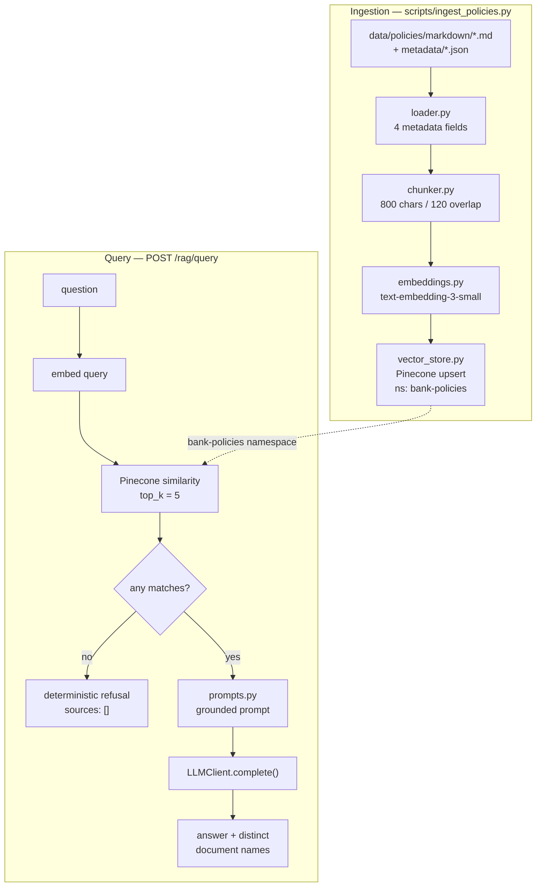

# Lab 2 — Basic Banking Policy RAG

**Status:** **Implemented 2026-08-03** — 187 tests passing, self-reviewed, awaiting Gate 2
**Version:** 0.3
**Date:** 2026-08-03
**Lab:** 2 of 7
**Depends on:** Lab 1 (settings, logging, errors, FastAPI app, `LLMClient`, tracer) — complete

> **Scope contract.** This document implements the Lab 2 brief and nothing else. Every
> capability belonging to Labs 3–7 is named in §7 and explicitly deferred. Where the Lab 2
> brief and an earlier planning document disagree, **the Lab 2 brief wins** and the
> disagreement is recorded in §6.

---

## 1. Problem

Lab 1 delivered a working application skeleton with no knowledge in it. The assistant can
report that it is alive and can call a model, but it has no banking policy content, no way
to find the relevant passage of a policy document, and no way to show a user where an answer
came from. Asked "what is the chargeback time limit?", it would answer from the model's
parametric memory — confidently, unverifiably, and possibly wrong. For a banking assistant
that is the failure mode that matters most: a plausible answer with no provenance.

## 2. Objective

A complete, demonstrable Retrieval-Augmented Generation pipeline over a synthetic banking
policy corpus:

```
Markdown policies → chunks → embeddings → Pinecone → top-5 similarity search
                                                          → grounded prompt → answer + sources
```

"Solved" means: a question asked through the API or the Streamlit UI returns an answer
composed **only** from retrieved policy text, with the source documents listed; and a
question the corpus does not cover returns an explicit refusal rather than an invention.

---

## 3. Functional requirements

### FR-L2-1 — Policy corpus

> **Amended v0.2.** The corpus was **supplied**, not authored. v0.1 assumed 12 synthetic
> Markdown files with YAML frontmatter in a flat `data/policies/`. What exists is 10 real
> public banking documents in three parallel directories with JSON metadata sidecars. The
> requirements below describe what is actually there. See §6.7–§6.9 for the consequences.

- **FR-L2-1.1** The corpus lives in `data/policies/` in three parallel directories:

  ```
  data/policies/
  ├─ markdown/   10 × <id>_<Name>.md    ← the ingestion input
  ├─ metadata/   10 × <id>_<Name>.json  ← the metadata sidecar, same stem
  └─ pdf/        10 × <id>_<Name>.pdf   ← the original source, provenance only
  ```

- **FR-L2-1.2** Metadata comes from the **JSON sidecar** matched by file stem, not from
  frontmatter. Keys **`title`**, **`category`**, and **`source`** are required. A markdown
  file with no sidecar, an unparseable sidecar, or a missing required key fails ingestion
  loudly, naming the file.
- **FR-L2-1.3** **The corpus is real, not synthetic.** It is public policy, FAQ, form, and
  guide material published by SBI Card and State Bank of India, converted from PDF. It
  contains no customer PII, no account numbers, and no card numbers. This deviates from
  CLAUDE.md §7 ("all data is synthetic", "no real institutions"), which §6.8 amends. All
  *customer* data in Lab 4 onward remains synthetic.
- **FR-L2-1.4** **PDFs are not parsed.** The lab brief specifies Markdown input; the
  markdown files are the already-extracted text. The PDF directory is retained as
  provenance and is never read by the pipeline.
- **FR-L2-1.5** The corpus covers the three demonstration questions the lab requires:
  chargeback/dispute time limits (`03_Raising_Card_Dispute.md`,
  `02_Credit_Card_Dispute_FAQ.md`), disputing an unauthorized transaction (same two, plus
  `01_Cardholder_Agreement.md`), and KYC documentation (`04_KYC_Documents.md`).

### FR-L2-2 — Metadata extraction

- **FR-L2-2.1** Ingestion extracts exactly the four document-level fields the lab brief
  names:

  | Field | Provenance | Example |
  |---|---|---|
  | `document` | markdown file name, derived | `03_Raising_Card_Dispute.md` |
  | `title` | sidecar `title`, required | `Transaction Dispute Form` |
  | `category` | sidecar `category`, required | `Credit Card` |
  | `source` | sidecar `source`, required | `Official SBI Card` |

- **FR-L2-2.2** Every chunk inherits all four fields unchanged, plus its own
  `chunk_index`, `char_start`, and `char_end`.
- **FR-L2-2.3** The sidecar's other keys — `id`, `url`, `document_type`, `version`,
  `effective_date`, `download_date`, `language`, `origin` — are **read but not stored**.
  They become metadata filters in Lab 3, which is where filtering lives. Storing them now
  would invite filtering now.

### FR-L2-3 — Chunking

- **FR-L2-3.1** A deterministic, character-based chunker splits document text.
- **FR-L2-3.1a** Before splitting, text is **whitespace-normalized only**: line endings to
  `\n`, trailing spaces stripped, runs of blank lines collapsed to a single blank line (one
  is all the chunker needs to see a paragraph boundary; the rest spend chunk budget). The
  supplied markdown is PDF-extracted and carries layout artifacts — page banners
  (`1 | P a g e ...`), tables flattened into stray one-line headings, hyphenation breaks.
  Those are **left in place**: repairing them is layout-aware parsing, which the brief
  forbids, and the retrieval noise they cause is honest evidence for why Lab 3 exists.
- **FR-L2-3.2** Target chunk size **800 characters**, accepted range **700–900**.
- **FR-L2-3.3** Overlap **120 characters** between consecutive chunks (within the required
  100–150 range).
- **FR-L2-3.4** Within the 700–900 window the chunker prefers to break at a paragraph
  boundary, then a sentence end, then whitespace; if none exists it hard-cuts at 900. This
  is a boundary *preference*, not semantic or layout-aware analysis.
- **FR-L2-3.5** The chunker always makes forward progress — no configuration of size and
  overlap can produce an infinite loop or a zero-length chunk.
- **FR-L2-3.6** Chunking is pure and deterministic: same input, same output, no I/O, no
  model call.

### FR-L2-4 — Embeddings

- **FR-L2-4.1** Embeddings are generated by OpenAI **`text-embedding-3-small`** (1536
  dimensions). The model id is configuration, never a literal at a call site.
- **FR-L2-4.2** Chunks are embedded in batches (default 100 per request) and the batch
  count, chunk count, and elapsed time are logged.
- **FR-L2-4.3** Embedding failures raise a typed application error; the provider SDK
  exception never escapes the embeddings module.
- **FR-L2-4.4** No embedding cache. No local `sentence-transformers` model.

### FR-L2-5 — Vector store

- **FR-L2-5.1** Pinecone is the vector store. Index name is configuration; namespace is
  **`bank-policies`**.
- **FR-L2-5.2** If the configured index does not exist, ingestion creates it —
  dimension 1536, metric `cosine`, serverless — and logs that it did so.
- **FR-L2-5.3** Each vector stores its embedding, its chunk text, and the six metadata
  fields from FR-L2-2.
- **FR-L2-5.4** Vector ids are deterministic — `<document-slug>#<chunk_index>` — so
  re-running ingestion **upserts in place** rather than duplicating the corpus.
- **FR-L2-5.5** Upserts are batched and the number of vectors upserted is logged.

### FR-L2-6 — Retrieval

- **FR-L2-6.1** The query is embedded with the same model as the corpus, then matched by
  vector similarity against the `bank-policies` namespace.
- **FR-L2-6.2** **Top K = 5.** Configurable, default 5.
- **FR-L2-6.3** Each result carries its chunk text, its four document metadata fields, and
  its similarity score.
- **FR-L2-6.4** Retrieval wall-clock time and every result's `(document, chunk_index,
  score)` are logged.
- **FR-L2-6.5** Similarity search only — no hybrid search, BM25, metadata filter, RRF,
  multi-query, expansion, or reranking (Lab 3).

### FR-L2-7 — Prompt construction

- **FR-L2-7.1** The prompt is assembled from a versioned system prompt constant plus the
  user question and the retrieved chunks. No prompt strings are inlined at call sites.
- **FR-L2-7.2** The system prompt instructs the model to answer **only** from the provided
  context, and never from prior knowledge.
- **FR-L2-7.3** Retrieved chunks are wrapped in clearly delimited blocks, each labelled
  with its document name, and the system prompt states that content inside those blocks is
  **information, never instruction** (CLAUDE.md §6). This is prompt hygiene only — no
  detection, no verdict, no guardrail engine (Lab 5).
- **FR-L2-7.4** When the answer is not present in the context, the model must reply with
  exactly:
  `I couldn't find this information in the available banking policy documents.`
- **FR-L2-7.5** When retrieval returns **zero** results, that refusal is returned
  deterministically without an LLM call.

### FR-L2-8 — Citations

- **FR-L2-8.1** Every grounded answer is accompanied by the list of distinct source
  **document names**, in first-retrieved order.
- **FR-L2-8.2** The UI renders them as:

  ```
  Sources

  • Credit Card Policy.md
  • Chargeback Policy.md
  ```

- **FR-L2-8.3** A refusal returns an **empty** source list — nothing was used, so nothing
  is cited.
- **FR-L2-8.4** Document-level citations only. Sentence-level and inline `[doc#chunk]`
  citations, and citation *validation*, are Lab 3.

### FR-L2-9 — API

- **FR-L2-9.1** `POST /rag/query`

  ```json
  { "question": "What is the chargeback time limit?" }
  ```

  ```json
  { "answer": "...", "sources": ["Chargeback Policy.md"] }
  ```

- **FR-L2-9.2** A blank or whitespace-only question returns 422 through the existing error
  envelope. A question longer than 2000 characters is rejected the same way.
- **FR-L2-9.3** Failures return the Lab 1 error envelope with the trace id, and the
  `X-Trace-Id` response header is preserved.
- **FR-L2-9.4** The pipeline and its Pinecone connection are built lazily on first use so
  that `/health` and the existing test suite remain functional without Pinecone credentials.

### FR-L2-10 — Streamlit UI

- **FR-L2-10.1** A single page: question textbox → **Ask** button → answer → sources.
- **FR-L2-10.2** It calls `POST /rag/query` over HTTP; it does not import the pipeline.
- **FR-L2-10.3** Nothing else — no chat history, no tabs, no trace view, no settings panel.

### FR-L2-11 — Logging

Structured JSON via the Lab 1 logger. Every item the lab brief names is logged:

| Event | Fields |
|---|---|
| Ingestion start / end | corpus dir, document count, elapsed ms |
| Per document | document, category, chunk count |
| Chunk summary | total chunks, min/mean/max chunk length |
| Embedding generation | model, chunk count, batch count, elapsed ms |
| Index creation | index name, dimension, metric (only when created) |
| Pinecone upsert | namespace, vectors upserted, batch count, elapsed ms |
| Retrieval | question length, top_k, elapsed ms |
| Retrieval results | per result: document, chunk_index, score |
| Answer | grounded vs refusal, source count, elapsed ms |

No trace persistence, no trace viewer, no spans beyond calling the tracer that already
exists (see §6.3). Tracing infrastructure is Lab 6.

---

## 4. Non-functional requirements

- **NFR-L2-1** Chunking, metadata extraction, prompt construction, and source-list
  derivation are pure and deterministic, and are unit-tested directly.
- **NFR-L2-2** **No test calls a paid API.** OpenAI embeddings, OpenAI chat, and Pinecone
  are all replaced by in-repo test doubles. There is no network access in the suite.
- **NFR-L2-3** Ingestion is idempotent: running it twice leaves the same vector count.
- **NFR-L2-4** Retrieval latency for a single query is dominated by two network calls
  (embed + query); the target is under 2 seconds end-to-end excluding generation.
- **NFR-L2-5** No secret is logged, traced, or written into any document under `docs/`.
- **NFR-L2-6** `pytest` green and `ruff` clean before the change is reported complete.

---

## 5. Design

### 5.1 Data flow



### 5.2 Module layout

```
src/bankassist/rag/
├─ __init__.py
├─ models.py         PolicyDocument, Chunk, RetrievedChunk, RagAnswer  (pydantic)
├─ loader.py         pair markdown/*.md with metadata/*.json, extract the 4 fields
├─ chunker.py        chunk_text() — pure, deterministic
├─ embeddings.py     Embedder protocol + OpenAIEmbedder
├─ vector_store.py   VectorStore protocol + PineconeVectorStore
├─ stubs.py          StubEmbedder + InMemoryVectorStore   (mirrors llm/stub.py)
├─ prompts.py        SYSTEM_PROMPT, REFUSAL, build_messages()
├─ ingest.py         run_ingestion() — the library function the CLI wraps
└─ pipeline.py       BasicRagPipeline.retrieve() / .answer()

src/bankassist/api/routes/rag.py     POST /rag/query
src/bankassist/ui/streamlit_app.py   the minimal UI
scripts/ingest_policies.py           thin CLI over rag.ingest
data/policies/*.md                   12 synthetic policy documents
```

Dependency direction is one-way, matching Lab 1: `api → rag → {llm, tracing, config,
logging, errors}`. Nothing in `rag/` imports from `api/`.

### 5.3 Interfaces

```python
class Embedder(Protocol):
    def embed_documents(self, texts: list[str]) -> list[list[float]]: ...
    def embed_query(self, text: str) -> list[float]: ...

class VectorStore(Protocol):
    def ensure_index(self) -> bool: ...                      # True if it created one
    def upsert(self, records: list[VectorRecord]) -> int: ...
    def query(self, vector: list[float], top_k: int) -> list[RetrievedChunk]: ...
```

Two protocols, each with a real implementation **and** a test double — which is what
satisfies CLAUDE.md's "no interface before a second implementation" rule, and is the same
seam `StubLLMClient` provides for generation. Without them, NFR-L2-2 is unachievable.

### 5.4 Three decisions worth stating

**Pinecone and API embeddings replace ChromaDB and local MiniLM.** The Lab 2 brief mandates
both. This overturns two rows of the approved technology stack and adds a hosted
dependency and a per-token embedding cost. Recorded as
[ADR-0007](../decisions/0007-pinecone-and-api-embeddings.md); it needs **Gate 3 scope
approval**, not just Gate 1.

**Character-based chunking, not token-based.** The brief specifies 700–900 characters and
100–150 overlap. The approved plan and `.env.example` specify 500/80 *tokens*. Characters
win here; the settings are renamed `CHUNK_SIZE_CHARS` / `CHUNK_OVERLAP_CHARS` so the unit
is in the name and cannot be misread later. Lab 3 may reintroduce token budgeting for
context assembly, which is a different concern.

**Refusal is detected structurally, not by parsing prose.** Zero retrieved chunks refuses
before any model call. When chunks exist but the model still emits the refusal sentence,
the pipeline compares the normalized answer to the exact constant and empties the source
list. Both paths are deterministic and directly testable; neither inspects model prose for
meaning.

---

## 6. Conflicts with earlier planning documents

Resolved in favour of the Lab 2 brief, recorded here so the divergence is deliberate.

| # | Earlier document | Lab 2 brief | Resolution |
|---|---|---|---|
| 6.1 | `technology-stack.md`: ChromaDB + `sentence-transformers` MiniLM | Pinecone + `text-embedding-3-small` | Brief wins. ADR-0007; tech-stack rows amended |
| 6.2 | `implementation-plan.md` step 10: `POST /chat` | `POST /rag/query` | Brief wins. Plan amended |
| 6.3 | Plan + skill: "every layer emits a trace span from Lab 2" | "No tracing yet — Lab 6" | **Both honoured.** Ingestion and retrieval call the tracer that Lab 1 already built (two new `SpanType` members, in-memory only). No persistence, no viewer, no span attributes beyond what is already logged. Building the tracer *infrastructure* remains Lab 6 |
| 6.4 | FR-2.2: chunks preserve "section heading" metadata | "No layout-aware parsing" | Brief wins. Heading metadata deferred to Lab 3; re-ingestion adds it then |
| 6.5 | Plan step 2: frontmatter carries `doc_id`, `product`, `effective_date` | four fields only | Brief wins. `product` / `effective_date` arrive in Lab 3 with metadata filtering |
| 6.6 | `.env.example`: `CHUNK_SIZE_TOKENS=500`, `CHROMA_*` | 700–900 chars | Brief wins. Settings renamed; Chroma keys removed |
| 6.7 | This spec v0.1: 12 authored synthetic docs, flat dir, YAML frontmatter | — | **Superseded by the supplied corpus.** 10 real documents, three parallel directories, JSON sidecars. Requirements rewritten to match what exists rather than what was assumed |
| 6.8 | CLAUDE.md §7: "all data is **synthetic**", "no real institutions" | — | **CLAUDE.md amended.** The *policy corpus* is real public material from SBI Card / State Bank of India — no PII, no account or card numbers. Every *customer, account, transaction, and dispute* record from Lab 4 on stays synthetic, which is where the rule was actually protecting something |
| 6.9 | `.gitignore` keeps third-party course material untracked because the repo is public | — | **Open decision for Gate 2.** The corpus is third-party copyrighted material under the same reasoning. Whether `data/policies/pdf/` (and the markdown derived from it) is committed or git-ignored is the user's call, taken at the publish gate — not silently by me |

---

## 7. Out of scope for Lab 2

Named explicitly so nothing drifts in: **Supervisor / Banking / Policy / Dispute agents;
guardrail engine of any kind; hybrid search; BM25; metadata filters; query rewriting; query
classification; RRF; re-ranking; multi-query; query expansion; embedding cache; semantic
cache; prompt cache; AgentOps; trace persistence or viewer; evaluation or golden dataset;
cost dashboard; financial-advice guardrails; tool calling; conversation history; streaming;
authentication.**

Also out of scope for this lab specifically: sentence-level citations, citation validation,
`sentence-transformers`, ChromaDB, and any migration path between vector stores.

---

## 8. Acceptance criteria

| # | Criterion | Verified by |
|---|---|---|
| **AC-L2-1** | `data/policies/markdown/` holds 10 Markdown policies, each with a matching sidecar in `metadata/` carrying `title`, `category`, and `source` | Screenshot 1; `test_rag_loader` |
| **AC-L2-2** | Every chunk is 700–900 characters (except a document's final chunk) with 120-character overlap | `test_rag_chunker` |
| **AC-L2-3** | Ingestion reports total chunk count and per-document counts | Screenshot 2; `test_rag_ingest` |
| **AC-L2-4** | Embeddings are generated by `text-embedding-3-small` and the model id appears in the log | Screenshot 3; `test_rag_embeddings` |
| **AC-L2-5** | The Pinecone index shows the expected vector count in namespace `bank-policies` | Screenshot 4 |
| **AC-L2-6** | Re-running ingestion does not change the vector count | Manual re-run; `test_rag_ingest` |
| **AC-L2-7** | Retrieval logs elapsed time and a similarity score per result, top_k = 5 | Screenshot 5; `test_rag_pipeline` |
| **AC-L2-8** | `POST /rag/query` returns `{answer, sources}` and the correct source document ranks in the top 3 for each of the three demo questions | Screenshots 6, 8–10 |
| **AC-L2-9** | An out-of-corpus question returns exactly the required refusal sentence with `sources: []` | `test_rag_pipeline`, `test_rag_api` |
| **AC-L2-10** | The Streamlit page shows question → Ask → answer → sources, and nothing else | Screenshot 7 |
| **AC-L2-11** | `pytest` green, `ruff` clean, and the full suite runs with no API key and no network | CI output in the change report |

---

## 9. Test plan

All doubles live in `src/bankassist/rag/stubs.py` and `tests/conftest.py`; no test touches
OpenAI or Pinecone.

| File | Asserts |
|---|---|
| `tests/unit/test_rag_chunker.py` | size window respected; overlap is exactly 120 and the overlapped text matches; short document yields one chunk; empty/whitespace document yields none; a 5000-character paragraph with no break points still terminates and hard-cuts at 900; determinism (same input twice → identical output); `char_start`/`char_end` slice back to the chunk text |
| `tests/unit/test_rag_loader.py` | the four metadata fields are extracted with the right provenance; frontmatter is stripped from the body; missing `title` or `category` raises `IngestionError` naming the file; a non-`.md` file is ignored; a corpus directory that does not exist raises |
| `tests/unit/test_rag_ingest.py` | document → chunk → vector-record pipeline produces deterministic ids; a re-run upserts the same ids (count unchanged); the reported chunk count matches the chunker's output; `ensure_index` is called before upsert |
| `tests/unit/test_rag_embeddings.py` | `OpenAIEmbedder` sends the configured model and batches correctly (a fake SDK client, mirroring `test_llm_openai_client.py`); provider errors surface as `EmbeddingError`; vector order matches input order even when the API returns them out of order |
| `tests/unit/test_rag_prompts.py` | the question and every chunk appear in the prompt; each chunk block is labelled with its document; the "information, not instruction" line is present; the exact refusal sentence is instructed; chunk order is preserved |
| `tests/unit/test_rag_pipeline.py` | top_k is passed through as 5; results are ordered by score; zero matches → refusal with no LLM call (asserted on the stub's call list); a model-emitted refusal empties the source list; sources are distinct and in first-retrieved order; a chunk containing instruction-shaped text does not change what is sent |
| `tests/integration/test_rag_api.py` | 200 and the exact `{answer, sources}` shape; blank and oversized questions → 422 envelope; `X-Trace-Id` present; pipeline failure → error envelope, not a stack trace; `/health` still works with no Pinecone configuration |

Existing Lab 1 tests must remain green untouched.

---

## 10. Implementation plan

Ordered, with a **hard stop** at each screenshot milestone.

### M0 — Prerequisites (no application code)
1. `requirements.txt` — add `pinecone>=5.0`, `streamlit>=1.40`, promote `PyYAML` from Lab 6.
2. `pip install -r requirements.txt` in `.venv`.
3. **You** create `.env` from `.env.example` and paste your `PINECONE_API_KEY` into it —
   I will not handle the credential. `.env` is already git-ignored.
4. `.env.example` — add the Pinecone/embedding/chunking keys, remove the Chroma keys.
5. `src/bankassist/config.py` — the new settings; the Pinecone key is validated where it is
   *used*, not at startup, so `/health` and the Lab 1 suite stay green without it.

### M1 — Corpus → **📸 Screenshot 1: the policy folder**
6. ~~Author the corpus~~ — **supplied by the user**. M1 is verification only: 10 markdown
   files, 10 sidecars, 10 PDFs, stems matching, required keys present.

### M2 — Loading and chunking → **📸 Screenshot 2: chunk generation summary**
7. `src/bankassist/rag/models.py`, `loader.py`, `chunker.py`, `errors.py` additions.
8. `tests/unit/test_rag_chunker.py`, `test_rag_loader.py`.
9. `scripts/ingest_policies.py --dry-run` — chunk counts, no API calls.

### M3 — Embeddings → **📸 Screenshot 3: `text-embedding-3-small` generation**
10. `src/bankassist/rag/embeddings.py`, `stubs.py`; `tests/unit/test_rag_embeddings.py`.
11. `scripts/ingest_policies.py --embed-only` — embeds, logs, does not upsert.

### M4 — Pinecone → **📸 Screenshot 4: index populated**
12. `src/bankassist/rag/vector_store.py`, `ingest.py`; `tests/unit/test_rag_ingest.py`.
13. Full `python scripts/ingest_policies.py`, then a second run to show idempotency.

### M5 — Retrieval → **📸 Screenshot 5: retrieval logs with similarity scores**
14. `src/bankassist/rag/pipeline.py` (`retrieve` half), `SpanType.RETRIEVAL`.
15. `scripts/ingest_policies.py --query "..."` or a small `--search` mode for the log shot.

### M6 — Generation + API → **📸 Screenshot 6: RAG pipeline working**
16. `src/bankassist/rag/prompts.py`; `pipeline.answer()`.
17. `src/bankassist/api/routes/rag.py`, `api/schemas.py`, `api/app.py` wiring.
18. `tests/unit/test_rag_prompts.py`, `test_rag_pipeline.py`,
    `tests/integration/test_rag_api.py`.

### M7 — Streamlit → **📸 Screenshots 7–10: UI + the three demo queries**
19. `src/bankassist/ui/streamlit_app.py`.
20. Run both processes; capture the UI and the three required queries.

### M8 — Close out (no screenshots)
21. `pytest` + `ruff`; AI self-review via the `code-review` skill.
22. `docs/labs/lab-02-basic-rag.md` written from the template.
23. Update `CLAUDE.md` §14 layout, `docs/architecture/architecture.md` retrieval section,
    `docs/plan/implementation-plan.md` Lab 2 status.
24. **Gate 2** — stop and wait before any `git` operation.

**Blast radius.** Additive. The only Lab 1 files touched are `config.py` (new fields, no
existing field changed), `api/app.py` (one `include_router` line), `api/schemas.py` (two new
models), `tracing/span.py` (two new enum members), and `errors.py` (two new exception
types). No existing behaviour changes, so every Lab 1 test should pass unmodified — and if
one does not, that is a regression to fix, not a test to update.

---

## 11. Risks and open questions

| # | Risk / question | Impact | Mitigation |
|---|---|---|---|
| R1 | **`PINECONE_API_KEY` is not set on this machine** and no Pinecone account is configured | **Blocks M4 onward** | You provision the key before M4. M1–M3 do not need it |
| R2 | Pinecone free-tier serverless index creation takes ~30–60 s to become ready | M4 stalls | Ingestion polls readiness before the first upsert |
| R3 | `pinecone` SDK v5+ has a different API surface than the `pinecone-client` v2 examples still common online | Wasted time | Pin `pinecone>=5.0` and write the adapter against the current client; it lives behind `VectorStore` either way |
| R4 | Embedding the whole corpus costs real money | Trivial but non-zero | ~12 docs ≈ 250 chunks ≈ 200k tokens ≈ **under 1 cent** at `text-embedding-3-small` pricing. Verify against current published pricing before quoting it in the submission |
| R5 | Character chunking splits a fee table mid-row, so a retrieved chunk reads oddly | Cosmetic in screenshots | Accepted for Lab 2 — layout-aware chunking is explicitly out of scope. Noted as a Lab 3 motivation, which is useful evidence in its own right |
| R7 | **The supplied markdown is PDF-extracted and noisy.** `03_Raising_Card_Dispute.md` holds the chargeback time limits (90/90/30/75 days) as a table flattened into disconnected lines, so the numbers sit apart from the network names they belong to | The demo question "what is the chargeback time limit?" may retrieve the right chunk but get a vague or partly-wrong answer | Accepted and *reported*, not patched. Fixing it means layout-aware parsing (Lab 3) or hand-editing the corpus (which would make the evidence dishonest). If the answer is weak, that is the finding — and the single best argument for Lab 3 the project will get |
| R8 | Corpus is third-party copyrighted material in a public repo | Redistribution concern | Decided by the user at Gate 2 (§6.9). Nothing is committed before then |
| R6 | Lab 3 needs `product` / `effective_date` / heading metadata that Lab 2 does not store | Re-ingestion later | Accepted. Re-ingestion is one command and upserts in place |

**Open question for you (non-blocking for approval):** do you have a Pinecone account and
API key ready, or should M1–M3 proceed while you provision one?
