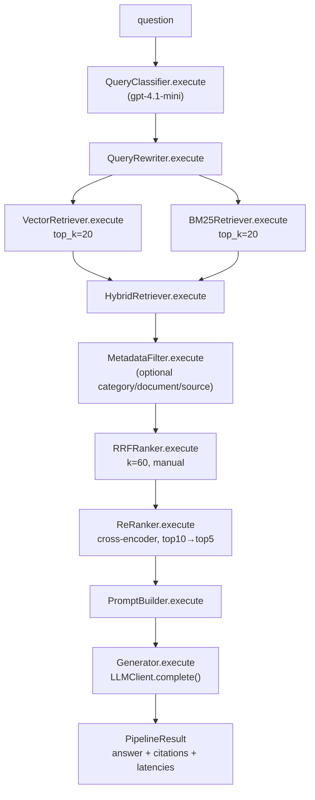

# Lab 3 — Enterprise Multi-Stage Banking RAG

**Status:** Draft — awaiting Gate 1 (plan) and Gate 3 (scope: ADR-0008 dependency) approval
**Version:** 0.1
**Date:** 2026-08-04
**Lab:** 3 of 7
**Depends on:** Lab 2 (Basic RAG — `BasicRagPipeline`, `Embedder`, `VectorStore`, corpus,
`LLMClient`) — complete and **unmodified** by this lab

> **Scope contract.** This document implements the Lab 3 brief and nothing else. Every
> capability belonging to Labs 4–7 — Supervisor/Banking/Policy/Dispute agents, tool
> calling, guardrails, prompt-injection detection, tracing infrastructure, evaluation,
> golden datasets, LLM-as-judge, semantic cache, prompt cache, cost dashboard — is named in
> §7 and explicitly deferred. Lab 2's `BasicRagPipeline` and `POST /rag/query` in `basic`
> mode are **not rewritten**; `basic` and `enterprise` remain independently selectable so a
> comparison can be demonstrated (FR-3.8, project-requirements.md).

---

## 1. Problem

Lab 2's `BasicRagPipeline` does plain vector similarity only: embed the question, top-5
cosine search, answer. Two known weaknesses fall directly out of that design (see Lab 2
§11 R5/R7): a question phrased with exact banking terminology that the corpus states
verbatim can still miss if the embedding doesn't surface it, and a question phrased
elliptically ("How long do I have?") retrieves poorly because nothing in it resembles the
policy text. There is also no way to scope a question to "only KYC documents" or "only
Credit Card documents" — every query searches the whole corpus — and no way to show *why*
a particular chunk was chosen over another. For a banking assistant, retrieval quality is
the ceiling on answer quality; Lab 3 raises that ceiling with classification, query
rewriting, hybrid (dense + sparse) retrieval, fusion, filtering, and reranking, while
keeping every stage inspectable and Lab 2's simpler pipeline available for comparison.

## 2. Objective

A second, selectable retrieval pipeline — `enterprise` — that extends Lab 2 without
touching it:

```
Question
  ↓ Query Classification        (Policy/FAQ/Procedure/Eligibility/Definition/Comparison/Unknown)
  ↓ Query Rewriting              (retrieval-oriented rewrite; original question preserved)
  ↓ Hybrid Retrieval             (Vector top-20  +  BM25 top-20, run independently)
  ↓ Metadata Filtering           (category / document / source, optional)
  ↓ Reciprocal Rank Fusion       (manual RRF, no external library)
  ↓ Re-ranking                   (cross-encoder, top-10 → top-5)
  ↓ Prompt Construction          (question + rewritten question + context + metadata + scores)
  ↓ Grounded Answer
  ↓ Citations
```

"Solved" means: `POST /api/v1/rag/query` with `"mode": "enterprise"` returns a grounded
answer and citations produced by this pipeline; `"mode": "basic"` (or the field omitted)
returns exactly Lab 2's behaviour, byte-for-byte; the Streamlit UI can run the same
question through both modes and show classification, rewritten query, retrieved
documents, and sources for the enterprise result; and every stage is independently unit
testable with mocked collaborators, never the whole pipeline.

---

## 3. Functional requirements

### FR-L3-1 — Architecture and typed contracts

- **FR-L3-1.1** Each pipeline stage is an independent class in its own module under
  `src/bankassist/rag/stages/`, with **exactly one public method**, `execute(...)`, that
  takes a typed request object and returns a typed result object. No stage returns a
  `dict`.
- **FR-L3-1.2** All request/result objects are Pydantic models (matching the rest of
  `rag/models.py`), living under `src/bankassist/rag/models/` (renamed from the current
  flat `models.py` — see §6.1).
- **FR-L3-1.3** `EnterpriseRagPipeline` (`src/bankassist/rag/pipeline/enterprise_pipeline.py`)
  **orchestrates only**: it calls each stage in sequence and assembles the
  `PipelineResult`. It contains no retrieval, ranking, filtering, or prompt logic of its
  own.
- **FR-L3-1.4** Every stage is constructed with its collaborators injected (embedder,
  vector store, BM25 index, LLM client, settings) — the same constructor-injection pattern
  `BasicRagPipeline` already uses — so each stage can be unit tested with mocked
  dependencies and never requires constructing the whole pipeline.
- **FR-L3-1.5** A `RetrievalPipeline` protocol (`Protocol` with an `answer(question: str) ->
  RagAnswer`-shaped method, or the narrower shared surface the two pipelines already share)
  is introduced so `basic` and `enterprise` are interchangeable at the call site. Lab 2's
  `BasicRagPipeline` implements it **without modification to its internals** — at most an
  unchanged method signature is declared to satisfy the protocol.

### FR-L3-2 — Mode selection

- **FR-L3-2.1** `POST /api/v1/rag/query` accepts an optional `mode: "basic" | "enterprise"`
  field, default `"basic"`. (Note: the existing Lab 2 route is `POST /rag/query`, not
  `/api/v1/rag/query` — see §6.2 for the resolution.)
- **FR-L3-2.2** `mode: "basic"` routes to the existing, untouched `BasicRagPipeline`.
  `mode: "enterprise"` routes to `EnterpriseRagPipeline`. Both pipeline instances are
  built lazily and cached on `app.state`, mirroring `get_pipeline()`'s existing pattern.
- **FR-L3-2.3** An unrecognized `mode` value is rejected with a 422 through the existing
  error envelope, not silently defaulted.

### FR-L3-3 — Query classification

- **FR-L3-3.1** `QueryClassifier.execute(question: str) -> ClassificationResult` calls the
  configured classifier model (`gpt-4.1-mini` — new config field, see §5.4) via the
  existing `LLMClient` interface, requesting a structured JSON response.
- **FR-L3-3.2** The classification label is one of exactly: `Policy`, `FAQ`, `Procedure`,
  `Eligibility`, `Definition`, `Comparison`, `Unknown`.
- **FR-L3-3.3** `ClassificationResult` carries `label`, `confidence` (0–1), and
  `latency_ms`. A malformed or unparseable model response classifies as `Unknown` with
  `confidence: 0.0` rather than raising — classification informs the pipeline, it does not
  gate it.
- **FR-L3-3.4** The classifier logs `original_question`, `label`, `confidence`, and
  `latency_ms` as one structured log line.

### FR-L3-4 — Query rewriting

- **FR-L3-4.1** `QueryRewriter.execute(question: str, classification: ClassificationResult)
  -> RewriteResult` produces a retrieval-oriented rewrite of the question (e.g. "How long
  do I have?" → "What is the chargeback dispute time limit?") via the `LLMClient`.
- **FR-L3-4.2** `RewriteResult` carries both `original_question` and `rewritten_question`
  — the original is never discarded and is threaded through to `PipelineResult` and the
  final prompt.
- **FR-L3-4.3** If rewriting fails or the model returns an empty string, `rewritten_question`
  falls back to `original_question` unchanged, logged as a fallback — never a pipeline
  failure.
- **FR-L3-4.4** The rewriter logs `original_question`, `rewritten_question`, and
  `latency_ms`.

### FR-L3-5 — Hybrid retrieval

- **FR-L3-5.1** `VectorRetriever.execute(query: str, top_k: int = 20) -> RetrievalResult`
  embeds `rewritten_question` (via the existing `Embedder`) and queries the existing
  Pinecone `VectorStore`, reusing both — no new embedding or vector-store code.
- **FR-L3-5.2** `BM25Retriever.execute(query: str, top_k: int = 20) -> RetrievalResult`
  scores `rewritten_question` against an in-process `rank_bm25.BM25Okapi` index built once
  at startup from the same chunk corpus Pinecone was ingested from (loaded from the
  existing chunked corpus, not re-chunked).
- **FR-L3-5.3** `HybridRetriever.execute(vector: RetrievalResult, bm25: RetrievalResult) ->
  HybridRetrievalResult` is a thin composition stage that pairs the two result sets for
  the fusion stage — it does not itself rank or filter.
- **FR-L3-5.4** Each `RetrievalResult` entry carries chunk text, the four Lab 2 metadata
  fields (`document`, `title`, `category`, `source`), `chunk_index`, and the retriever's
  native score (cosine similarity or BM25 score).
- **FR-L3-5.5** Vector and BM25 retrieval log their retrieved documents, scores, and
  latency, independently.

### FR-L3-6 — Metadata filtering

- **FR-L3-6.1** `MetadataFilter.execute(results: HybridRetrievalResult, filters:
  MetadataFilters | None) -> HybridRetrievalResult` narrows both result sets to entries
  matching an optional filter on `category`, `document`, and/or `source` (exact match,
  AND across provided fields).
- **FR-L3-6.2** `filters=None` (the default) is a no-op passthrough — filtering is opt-in,
  not applied to every query by default.
- **FR-L3-6.3** Filtering runs **before** RRF, so fusion ranks only within the filtered
  candidate set.

### FR-L3-7 — Reciprocal Rank Fusion

- **FR-L3-7.1** `RRFRanker.execute(filtered: HybridRetrievalResult) -> RRFResult`
  implements RRF by hand: for each chunk, `score = Σ 1 / (k + rank)` over every result list
  it appears in (rank is 1-indexed within that list; `k = 60`, configurable). No
  external RRF library.
- **FR-L3-7.2** A chunk present in both the vector and BM25 result sets accumulates both
  terms; a chunk present in only one accumulates one.
- **FR-L3-7.3** `RRFResult` is sorted descending by fused score and carries, per chunk, its
  vector rank/score (if present), BM25 rank/score (if present), and fused RRF score.
- **FR-L3-7.4** The fused ranking is logged.

### FR-L3-8 — Re-ranking

- **FR-L3-8.1** `ReRanker.execute(fused: RRFResult, top_n: int = 5) -> RerankResult` takes
  the fused top-10 candidates and re-scores them with a cross-encoder
  (`cross-encoder/ms-marco-MiniLM-L-6-v2`, per [ADR-0008](../decisions/0008-reranker-dependency.md)),
  returning the top 5.
- **FR-L3-8.2** `RerankResult` carries, per surviving chunk, its pre-rerank (RRF) rank and
  its post-rerank rank and score, so before/after is directly inspectable without
  recomputation.
- **FR-L3-8.3** The cross-encoder model loads once (process-lifetime singleton, mirroring
  the Pinecone-client lazy-singleton pattern in `api/routes/rag.py`), not per request.
- **FR-L3-8.4** Before-ranking and after-ranking orderings, with scores, are logged.

### FR-L3-9 — Prompt construction

- **FR-L3-9.1** `PromptBuilder.execute(request: PromptBuildRequest) -> PromptContext`
  assembles a prompt containing: the original question, the rewritten question, each
  retrieved chunk's text, its document metadata (`document`, `title`, `category`,
  `source`), and its retrieval score (the rerank score).
- **FR-L3-9.2** The system prompt instructs the model to answer **only** from the provided
  context — reusing Lab 2's grounding and refusal contract (`prompts.SYSTEM_PROMPT`,
  `REFUSAL`), extended (not replaced) with the additional context fields.
- **FR-L3-9.3** `PromptContext` records the number of chunks included and an estimated
  token count (character-based estimate; no new dependency — see §6.3 on `tiktoken`).
- **FR-L3-9.4** Prompt construction is logged: chunk count, token estimate.

### FR-L3-10 — Generation

- **FR-L3-10.1** `Generator.execute(context: PromptContext) -> GenerationResult` calls the
  existing `LLMClient.complete()` — no new LLM abstraction.
- **FR-L3-10.2** Zero retrieved chunks (post-filter, post-rerank) short-circuits to Lab 2's
  deterministic refusal, no LLM call — same contract as `BasicRagPipeline.answer()`.
- **FR-L3-10.3** Completion latency is logged.

### FR-L3-11 — Citations and explainability

- **FR-L3-11.1** `PipelineResult` (the object `EnterpriseRagPipeline` returns) contains:
  `original_question`, `classification`, `rewritten_question`, `vector_results`,
  `bm25_results`, `rrf_results`, `reranked_results`, `prompt_context`, `generated_answer`,
  `citations`, `latencies` (per-stage, keyed by stage name).
- **FR-L3-11.2** Citations are the distinct source document names from the top-5 reranked
  chunks actually used in the prompt, in reranked order — same shape as Lab 2's
  `sources: list[str]`, so the API response stays compatible across modes.
- **FR-L3-11.3** `PipelineResult` is designed to be consumable, unmodified, as the input to
  Lab 6 AgentOps — it is not itself a trace, but every field a trace would need is already
  present and typed.

### FR-L3-12 — API

- **FR-L3-12.1** `POST /api/v1/rag/query`

  ```json
  {"question": "How long do I have to dispute a transaction?", "mode": "enterprise"}
  ```

  ```json
  {
    "answer": "...",
    "sources": ["03_Raising_Card_Dispute.md"],
    "mode": "enterprise",
    "classification": {"label": "Procedure", "confidence": 0.91},
    "rewritten_question": "What is the chargeback dispute time limit?"
  }
  ```

  `mode: "basic"` (or omitted) returns exactly Lab 2's response shape plus an added
  `"mode": "basic"` field — additive, not breaking (see §6.2 on the response-shape change).
- **FR-L3-12.2** Existing error envelope, trace-id header, and 422 validation behaviour are
  unchanged for both modes.

### FR-L3-13 — Streamlit UI

- **FR-L3-13.1** A mode selector (`st.radio` or `st.selectbox`: Basic / Enterprise) above
  the existing question box.
- **FR-L3-13.2** In `enterprise` mode, the page additionally shows: classification label +
  confidence, rewritten query, and the list of retrieved documents (name + score) —
  alongside the answer and sources Lab 2 already renders.
- **FR-L3-13.3** No internal prompts are ever displayed in the UI.
- **FR-L3-13.4** `basic` mode renders exactly as Lab 2 today — question → Ask → answer →
  sources, nothing added.

### FR-L3-14 — Logging

- **FR-L3-14.1** Every stage listed in §3.3–§3.9 emits at least one structured JSON log
  line via the existing logger, with the fields specified in that stage's FR. No `print()`.
- **FR-L3-14.2** No tracing infrastructure, span persistence, or trace viewer (Lab 6).
  Stages log directly; they do not call the Lab 1 in-memory tracer's span API beyond what
  Lab 2 already established as acceptable pre-Lab-6 usage (see Lab 2 §6.3) — **actually
  out of scope here**: this lab does not add new `SpanType` members. Logging only.

---

## 4. Non-functional requirements

- **NFR-L3-1** Every stage is a separate class with one public method (`execute`), unit
  tested in isolation with mocked/stub collaborators — no test constructs the full
  pipeline to test a single stage's logic.
- **NFR-L3-2** No test calls a paid API or loads the real cross-encoder model. `Embedder`,
  `VectorStore`, `LLMClient`, BM25 index, and `Reranker` all have stub doubles for the new
  stages that need them (classifier, rewriter, generator reuse `StubLLMClient`; the
  reranker gets a new `StubReranker`).
- **NFR-L3-3** RRF, metadata filtering, and hybrid composition are pure functions with no
  I/O — directly unit-tested with hand-constructed inputs, no mocking needed.
- **NFR-L3-4** `mode: "basic"` behaviour is byte-identical to Lab 2's current behaviour;
  every existing Lab 2 test continues to pass unmodified.
- **NFR-L3-5** No secret is logged. `pytest` green and `ruff` clean before the change is
  reported complete.
- **NFR-L3-6** The architecture allows Lab 4 to call `EnterpriseRagPipeline` as a black box,
  Lab 5 to wrap `Generator` with a guardrail decorator, Lab 6 to wrap every stage with a
  tracing decorator, and Lab 7 to wrap `QueryClassifier`/`Generator` with a caching
  decorator — **without modifying any stage class**. This is validated at design review by
  checking no stage reaches into another stage's internals or the pipeline's orchestration
  logic.

---

## 5. Design

### 5.1 Data flow



### 5.2 Module layout

```
src/bankassist/rag/
├─ pipeline/
│  ├─ __init__.py
│  ├─ basic_pipeline.py           # BasicRagPipeline moved here unmodified (see §6.1)
│  └─ enterprise_pipeline.py      # EnterpriseRagPipeline — orchestration only
├─ stages/
│  ├─ classifier.py               # QueryClassifier
│  ├─ query_rewriter.py           # QueryRewriter
│  ├─ vector_retriever.py         # VectorRetriever
│  ├─ bm25_retriever.py           # BM25Retriever + BM25 index builder
│  ├─ hybrid_retriever.py         # HybridRetriever
│  ├─ metadata_filter.py          # MetadataFilter
│  ├─ rrf_ranker.py               # RRFRanker
│  ├─ reranker.py                 # ReRanker (cross-encoder)
│  ├─ prompt_builder.py           # PromptBuilder
│  └─ generator.py                # Generator
├─ models/
│  ├─ __init__.py
│  ├─ classification_result.py
│  ├─ rewrite_result.py
│  ├─ retrieval_context.py        # MetadataFilters, PromptBuildRequest
│  ├─ retrieval_result.py         # RetrievalResult, HybridRetrievalResult, RRFResult
│  ├─ rerank_result.py            # RerankResult
│  └─ pipeline_result.py          # PipelineResult
├─ interfaces/
│  ├─ classifier.py               # Classifier Protocol
│  ├─ retriever.py                # Retriever Protocol (Vector/BM25 share shape)
│  ├─ reranker.py                 # Reranker Protocol
│  └─ prompt_builder.py           # PromptBuilder Protocol
├─ stubs.py                       # existing + StubReranker, StubBM25Index
├─ (existing, unchanged) loader.py, chunker.py, embeddings.py,
│  vector_store.py, ingest.py, prompts.py
└─ __init__.py
```

Dependency direction stays one-way: `api → rag.pipeline → rag.stages → {rag.interfaces,
rag.models, llm, config, logging, errors}`. Stages never import the pipeline module.

### 5.3 Interfaces

```python
# rag/interfaces/classifier.py
class Classifier(Protocol):
    def execute(self, question: str) -> ClassificationResult: ...

# rag/interfaces/retriever.py
class Retriever(Protocol):
    def execute(self, query: str, top_k: int = 20) -> RetrievalResult: ...

# rag/interfaces/reranker.py
class Reranker(Protocol):
    def execute(self, fused: RRFResult, top_n: int = 5) -> RerankResult: ...

# rag/interfaces/prompt_builder.py
class PromptBuilderProtocol(Protocol):
    def execute(self, request: PromptBuildRequest) -> PromptContext: ...
```

Each stage class implements one of these (or, for the pure-function stages —
`HybridRetriever`, `MetadataFilter`, `RRFRanker` — a same-shaped `execute` without a
Protocol, since they have exactly one implementation and CLAUDE.md's "no interface before
a second implementation" rule applies). `VectorRetriever` and `BM25Retriever` both satisfy
`Retriever`, which is what lets `HybridRetriever.execute` accept either's `RetrievalResult`
uniformly.

### 5.4 Config additions (`config.py`)

| Field | Default | Purpose |
|---|---|---|
| `llm_model_classifier` | `"gpt-4.1-mini"` | Query classification model (FR-L3-3.1) |
| `retrieval_vector_top_k_enterprise` | `20` | Vector leg of hybrid retrieval (FR-L3-5.1) |
| `retrieval_bm25_top_k` | `20` | BM25 leg (FR-L3-5.2) |
| `rrf_k` | `60` | RRF constant (FR-L3-7.1) |
| `rerank_candidate_count` | `20` (was `10`) | Fused candidates entering rerank (FR-L3-8.1) |
| `rerank_top_n` | `8` (was `5`) | Final reranked count (FR-L3-8.1) |
| `reranker_model` | `"cross-encoder/ms-marco-MiniLM-L-6-v2"` | ADR-0008 |

**Amended 2026-08-04** (found while validating Lab 4's Policy Agent, which calls this
pipeline unmodified): the cross-encoder reranker can rank a terse, correct, list-formatted
chunk (e.g. the KYC "List of OVDs" chunk) below denser boilerplate chunks from the same
document, even though RRF fusion (vector+BM25) ranked it reasonably. `rerank_candidate_count`
10→20 stopped it being truncated before reaching the reranker at all; `CrossEncoderReranker`
now reciprocal-rank-fuses the RRF pre-rank with the cross-encoder rank (`reranker.py`,
`fuse_ranks`) instead of trusting the cross-encoder score alone, and `rerank_top_n` 5→8
gives that fused ranking room. See the docstring in `rag/stages/reranker.py` for the full
investigation. A markdown-corpus cleanup (fixing PDF-extraction artifacts and chunk
boundaries) would be a more durable fix and remains a suggested follow-up, not done here.

Extending `ModelTier` from `Literal["fast", "strong"]` to `Literal["fast", "strong",
"classifier"]` (and `model_for_tier` accordingly) is the one small, additive touch to the
existing `LLMClient`/`Settings` contract this lab needs — no existing tier's resolved
model id changes.

### 5.5 Decisions worth stating

**`sentence-transformers` returns, scoped to reranking only.** Recorded in
[ADR-0008](../decisions/0008-reranker-dependency.md), which needs its own Gate 3 approval
alongside this plan, since it reverses part of ADR-0007.

**RRF and metadata filtering are pure functions, not classes with hidden state.** Both take
their full input and return their full output with no I/O — this is what makes NFR-L3-3
achievable and keeps the pipeline's business logic (per the brief's "orchestrator contains
almost no business logic" requirement) entirely inside the stages, testable without mocks.

**The BM25 index is built once, in-process, from the same chunked corpus Lab 2 already
ingested — not from a fresh re-chunk.** Avoids a second chunking code path; the enterprise
pipeline's `BM25Retriever` reads the corpus via `rag.ingest`'s existing chunk-producing
functions at construction time (or from a small on-disk cache built by an extended
`scripts/ingest_policies.py` step) so `basic` and `enterprise` search identical text.

**Token estimate, not `tiktoken`.** The Lab 3 brief's scope list does not mention
`tiktoken`, and adding it purely for an estimate is unnecessary — a character-count-based
estimate (`len(text) // 4`, documented as an estimate, not exact) satisfies FR-L3-9.3
without a new dependency. This narrows the pre-existing `implementation-plan.md` Lab 3
sketch, which mentioned `tiktoken`; recorded as a resolved conflict in §6.3.

---

## 6. Conflicts with earlier planning documents

| # | Earlier document | This lab's brief | Resolution |
|---|---|---|---|
| 6.1 | Lab 2 module layout: `rag/pipeline.py`, `rag/models.py` (flat files) | Lab 3 brief's suggested tree: `rag/pipeline/`, `rag/models/` (packages) | **Brief wins**, following the ADR-0007 precedent. `BasicRagPipeline` moves from `rag/pipeline.py` to `rag/pipeline/basic_pipeline.py` and `rag/models.py` becomes `rag/models/` with its existing classes split or re-exported — a **mechanical move**, not a rewrite: no method body, field, or test assertion in `BasicRagPipeline` changes. Import paths in `api/routes/rag.py` and existing tests update accordingly. This is the one place Lab 3 must touch a Lab 2 file, and it is confined to import paths |
| 6.2 | Lab 2: `POST /rag/query` (no version prefix; `app.py` has no `/api/v1`) | Lab 3 brief: `POST /api/v1/rag/query` | **Brief wins for the new capability, without breaking the old route.** `app.py` gains an `/api/v1` router mount; the existing `/rag/query` path is decided at implementation time to either (a) stay as an unversioned alias forwarding to the same handler, or (b) be removed in favor of `/api/v1/rag/query` for both modes. Recommendation: **(a)**, since NFR-L3-4 requires Lab 2 behaviour to stay byte-identical, and removing a route is exactly the kind of change that breaks "identical" — flagged for explicit confirmation at Gate 1, not decided silently |
| 6.3 | `implementation-plan.md` Lab 3 sketch: `tiktoken` for context budgeting | Lab 3 brief's explicit scope list does not mention `tiktoken` | **Brief's silence + CLAUDE.md scope discipline win.** A character-based token *estimate* satisfies FR-L3-9.3 without a new dependency. `implementation-plan.md` Lab 3 section will be updated to drop the `tiktoken` mention when this plan is approved |
| 6.4 | `implementation-plan.md` Lab 3 sketch: citation validation (`[doc_id#chunk]` markers, deterministic post-check) | Lab 3 brief's explicit scope list has **no citation validation** requirement — only "Sources" (document-level, same shape as Lab 2) | **Brief wins.** Document-level citations only, matching FR-L2-8.4's original note that "sentence-level and inline `[doc#chunk]` citations, and citation validation, are Lab 3" — narrowed here to **not** Lab 3 either. Inline citation validation is deferred again, tracked as a Lab 5/6 candidate (output-guardrail / eval scoring both plausibly own it) |
| 6.5 | `implementation-plan.md` Lab 3 sketch: query classifier returns "policy / account / dispute / general / out-of-domain" | Lab 3 brief's labels: `Policy, FAQ, Procedure, Eligibility, Definition, Comparison, Unknown` | **Brief wins.** `project-requirements.md` FR-3.1 and `implementation-plan.md`'s Lab 3 step 2 will be updated to the brief's label set when this plan is approved |
| 6.6 | `implementation-plan.md` Lab 3 sketch: query rewriter does "pronoun resolution against **history**" | This app has no conversation/session state (Lab 1's `session_id` field exists in the API contract but Lab 2/3 don't implement multi-turn) | **Narrowed to what exists.** `QueryRewriter` rewrites the single incoming question for retrieval quality (abbreviation expansion, implicit-referent resolution using only the question itself); true multi-turn pronoun resolution against prior turns is out of scope until session state exists (no lab before 4 introduces it) |
| 6.7 | ADR-0007 "Lab 3" consequence: reranker choice is an open item | This document | **Resolved** by [ADR-0008](../decisions/0008-reranker-dependency.md) |

---

## 7. Out of scope for Lab 3

Named explicitly, matching the brief's own exclusion list and CLAUDE.md's standing scope
discipline: **Supervisor / Banking / Policy / Dispute agents; any tool calling; the
guardrail engine, prompt-injection detection, financial-advice detection, or output
moderation; AgentOps and the real tracer/trace viewer; evaluation, golden datasets, or
LLM-as-judge; semantic cache; prompt cache; cost dashboard.**

Also out of scope for this lab specifically: inline/sentence-level citation markers and
citation *validation* (see §6.4); multi-turn conversation history and pronoun resolution
against it (see §6.6); multi-query variant generation in the rewriter (matches the standing
scope-cut list in `implementation-plan.md`); the `BAAI/bge-reranker-v2-m3` model (ADR-0008
picks the MiniLM cross-encoder); `tiktoken`-based exact token counting (see §6.3).

---

## 8. Acceptance criteria

| # | Criterion | Verified by |
|---|---|---|
| **AC-L3-1** | `QueryClassifier.execute()` returns one of the seven defined labels with a confidence and latency, logged | Screenshot 1; `test_classifier.py` |
| **AC-L3-2** | `QueryRewriter.execute()` preserves `original_question` and returns a `rewritten_question`, logged; a rewrite failure falls back to the original rather than raising | Screenshot 2; `test_query_rewriter.py` |
| **AC-L3-3** | `VectorRetriever` and `BM25Retriever` each independently return up to 20 results with scores and latency, logged separately | Screenshots 3–4; `test_vector_retriever.py`, `test_bm25_retriever.py` |
| **AC-L3-4** | `HybridRetriever` composes both result sets without altering either's scores | Screenshot 5; `test_hybrid_retriever.py` |
| **AC-L3-5** | `RRFRanker.execute()` fusion score matches the hand-computed RRF formula (k=60) for a hand-constructed fixture with known ranks in both lists | Screenshot 6; `test_rrf_ranker.py` |
| **AC-L3-6** | `MetadataFilter.execute()` with a `category="KYC"` filter returns only KYC-category chunks, and `filters=None` is a no-op | `test_metadata_filter.py` |
| **AC-L3-7** | `ReRanker.execute()` returns exactly 5 results from 10 candidates, each carrying its pre- and post-rerank rank/score; before/after logged | Screenshot 7; `test_reranker.py` |
| **AC-L3-8** | A query answered through both `basic` and `enterprise` modes on the same question produces two `PipelineResult`/`RagAnswer` records suitable for a side-by-side comparison table, and at least one keyword-exact demo query retrieves a document via BM25/hybrid that pure vector search alone (Lab 2) misses or ranks lower | Screenshot 8; `test_enterprise_pipeline.py`, comparison harness output |
| **AC-L3-9** | The Streamlit UI's mode selector switches between Basic and Enterprise, showing classification, rewritten query, and retrieved documents only in Enterprise mode, and never shows the raw prompt | Screenshot 9 |
| **AC-L3-10** | `POST /api/v1/rag/query` with `mode: "enterprise"` returns a grounded answer with citations resolving to real retrieved documents | Screenshot 10 |
| **AC-L3-11** | Structured logs exist for every stage (classification, rewrite, vector retrieval, BM25 retrieval, RRF, reranking) on a single request | Screenshot 11 |
| **AC-L3-12** | `pytest` green (all new + all existing Lab 1/2 tests), `ruff` clean, no test calls a paid API or loads the real cross-encoder | Screenshot 12 |
| **AC-L3-13** | `mode: "basic"` (or omitted) produces the same `answer`/`sources` Lab 2 produced before this lab, for the three Lab 2 demo questions | `test_rag_pipeline.py` (unmodified), manual comparison |

---

## 9. Test plan

All new stub doubles live in `rag/stubs.py` (extended) and follow the `_seed`/`_pipeline`
harness pattern established in `tests/unit/test_rag_pipeline.py`. No test touches OpenAI,
Pinecone, or downloads the cross-encoder model.

| File | Asserts |
|---|---|
| `tests/unit/test_classifier.py` | correct label parsed from a scripted `StubLLMClient` JSON response; malformed response → `Unknown`/0.0 confidence, no exception; all 7 labels round-trip; latency and log fields present |
| `tests/unit/test_query_rewriter.py` | original question preserved unchanged; rewritten question comes from the stub LLM; empty/failed rewrite falls back to original; log fields present |
| `tests/unit/test_vector_retriever.py` | reuses `StubEmbedder`/`InMemoryVectorStore`; returns ≤ `top_k` results ordered by score; empty index → empty result, no exception |
| `tests/unit/test_bm25_retriever.py` | a query containing an exact corpus term ranks that chunk top-1, even when a vector-only stub would miss it (this is the retrieval-quality claim AC-L3-8 depends on); empty corpus → empty result |
| `tests/unit/test_hybrid_retriever.py` | both input result sets pass through unaltered; a chunk present in only one list is still represented |
| `tests/unit/test_metadata_filter.py` | exact-match filtering on `category`, `document`, `source` individually and combined (AND); `None` filter is a no-op; a filter matching nothing returns empty, not an error |
| `tests/unit/test_rrf_ranker.py` | hand-computed RRF score for fixtures with known ranks (both-lists case, vector-only case, BM25-only case); output sorted descending; `k` is configurable and affects the score |
| `tests/unit/test_reranker.py` | uses `StubReranker` (scripted scores); truncates 10 → 5; pre-rank and post-rank both present per result; empty input → empty output, no crash |
| `tests/unit/test_prompt_builder.py` | prompt includes original question, rewritten question, chunk text, metadata, and score for every included chunk; chunk count and token estimate reported; grounding/refusal instruction present (reused from Lab 2 `prompts.py`) |
| `tests/unit/test_generator.py` | delegates to `LLMClient.complete()` via `StubLLMClient`; latency logged; zero-chunk input short-circuits to the Lab 2 refusal with no LLM call |
| `tests/unit/test_enterprise_pipeline.py` | full `PipelineResult` populated with every field named in FR-L3-11.1, built entirely from stage-level stubs (never a real network call); `mode="enterprise"` end-to-end with an all-stub pipeline produces a grounded answer and citations for a seeded question |
| `tests/unit/test_rag_pipeline.py` | **unmodified** — Lab 2's existing file, still green, proving `basic` mode is untouched |
| `tests/integration/test_rag_api.py` | extended: `mode` field accepted and defaulted; `mode: "enterprise"` returns the extended response shape; invalid `mode` → 422; `mode: "basic"`/omitted response is unchanged from Lab 2's existing assertions |
| `tests/unit/test_rag_comparison.py` (or a script-level test) | basic vs. enterprise on the same seeded question produce two comparably-shaped results; the keyword-exact demo case shows BM25/hybrid finding what vector-only misses |

---

## 10. Implementation plan

Ordered, with a **hard stop** at each screenshot milestone. This is a plan; nothing here
is written until Gate 1 is approved.

### M0 — Prerequisites (no application code beyond dependency install)
1. `docs/decisions/0008-reranker-dependency.md` — **Gate 3 approval** (adds
   `sentence-transformers` back, scoped to reranking).
2. `requirements.txt` — add `rank-bm25`, `sentence-transformers` (CPU); remove the
   "Added in later labs" comment lines for both once added.
3. `pip install -r requirements.txt` in `.venv`.
4. `src/bankassist/config.py` — new fields from §5.4; extend `ModelTier`.

### M1 — Module scaffold (mechanical move, no behaviour change)
5. Move `rag/pipeline.py` → `rag/pipeline/basic_pipeline.py`, `rag/models.py` →
   `rag/models/` (package, re-exporting the same names). Update imports in
   `api/routes/rag.py` and existing tests. Run `pytest` — every Lab 1/2 test must still
   pass, proving the move was mechanical.
6. Scaffold `rag/stages/`, `rag/interfaces/`, new `rag/models/*` files (empty classes with
   typed fields only, per §5.3).

### M2 — Classification → **📸 Screenshot 1**
7. `stages/classifier.py`, `models/classification_result.py`, `interfaces/classifier.py`.
8. `tests/unit/test_classifier.py`.

### M3 — Query rewriting → **📸 Screenshot 2**
9. `stages/query_rewriter.py`, `models/rewrite_result.py`.
10. `tests/unit/test_query_rewriter.py`.

### M4 — Vector + BM25 retrieval → **📸 Screenshots 3–4**
11. `stages/vector_retriever.py`, `stages/bm25_retriever.py` (+ BM25 index builder reusing
    `rag.ingest`'s chunk output), `models/retrieval_result.py`, `interfaces/retriever.py`.
12. `tests/unit/test_vector_retriever.py`, `test_bm25_retriever.py`.

### M5 — Hybrid composition → **📸 Screenshot 5**
13. `stages/hybrid_retriever.py`.
14. `tests/unit/test_hybrid_retriever.py`.

### M6 — Metadata filtering
15. `stages/metadata_filter.py`, `models/retrieval_context.py` (`MetadataFilters`).
16. `tests/unit/test_metadata_filter.py`.

### M7 — RRF → **📸 Screenshot 6**
17. `stages/rrf_ranker.py`.
18. `tests/unit/test_rrf_ranker.py`.

### M8 — Re-ranking → **📸 Screenshot 7**
19. `stages/reranker.py` (cross-encoder), `models/rerank_result.py`,
    `interfaces/reranker.py`, `StubReranker` in `rag/stubs.py`.
20. `tests/unit/test_reranker.py`.

### M9 — Prompt construction + generation → **📸 Screenshots 8, 10**
21. `stages/prompt_builder.py`, `stages/generator.py`, `models/pipeline_result.py`.
22. `pipeline/enterprise_pipeline.py` — orchestration, wiring stages 7–21 in order.
23. `api/routes/rag.py` — `mode` dispatch; `api/schemas.py` — extended request/response
    models; `app.py` — `/api/v1` mount decision per §6.2 (confirm at Gate 1).
24. `tests/unit/test_prompt_builder.py`, `test_generator.py`,
    `test_enterprise_pipeline.py`; `tests/integration/test_rag_api.py` extensions.
25. A basic-vs-enterprise comparison run on the three Lab 2 demo questions plus one
    keyword-exact case chosen to demonstrate BM25's contribution.

### M10 — Streamlit → **📸 Screenshot 9**
26. `ui/streamlit_app.py` — mode selector, classification/rewrite/retrieved-docs display
    for enterprise mode only.

### M11 — Logs and close-out → **📸 Screenshots 11–12**
27. Confirm structured logs for every stage on one live (or stub-driven, for the screenshot
    if no live credentials) request.
28. `pytest` + `ruff`; AI self-review via the `code-review` skill.
29. `docs/labs/lab-03-enterprise-rag.md` written from the template.
30. Update `docs/architecture/architecture.md` §5 (currently stale — still describes
    ChromaDB + local MiniLM + local sentence-transformers reranker predating ADR-0007;
    reconciled here to Pinecone + OpenAI embeddings + the ADR-0008 reranker) and
    `docs/plan/implementation-plan.md` Lab 3 section (labels, drop `tiktoken`/citation
    validation per §6).
31. **Gate 2** — stop and wait before any `git` operation.

**Blast radius.** Additive except the mechanical M1 move (import-path-only) and the
`config.py`/`ModelTier` extension. `BasicRagPipeline`'s method bodies, `rag/prompts.py`,
`rag/loader.py`, `rag/chunker.py`, `rag/embeddings.py`, `rag/vector_store.py` are untouched.
Every existing Lab 1/2 test should pass unmodified after M1; a failure there is a
regression, not a test to update.

---

## 11. Risks and open questions

| # | Risk / question | Impact | Mitigation |
|---|---|---|---|
| R1 | `sentence-transformers`/`torch` (ADR-0008) adds ~2.5 GB and a model download to the environment | Slower `pip install`, first-run latency | Accepted per ADR-0008; model loads once at process start, not per request |
| R2 | §6.2's `/api/v1` prefix decision (alias old route vs. replace it) isn't fully resolved | Could silently break Lab 2's existing route if decided wrong | Explicit confirmation requested at Gate 1, recommendation given (alias, don't remove) |
| R3 | BM25 needs the corpus's chunk text in-process; today only Pinecone (chunk text as metadata) and the ingestion script (transient) have it | Extra plumbing to reconstruct or cache the chunk set for BM25 | `BM25Retriever` reads via `rag.ingest`'s existing chunk-producing functions at pipeline construction time — no new storage layer, corpus stays the single source of truth |
| R4 | The keyword-exact demo case for AC-L3-8 needs to be chosen carefully so it actually demonstrates BM25's value against the noisy PDF-extracted corpus (Lab 2 R7) | A weak demo case undercuts the lab's central claim | Select the case during M9 using the fee/dispute-table terms Lab 2 already flagged as vector-search-unfriendly; report honestly if none clearly demonstrates the gap |
| R5 | `gpt-4.1-mini` may not be the exact model id available on the configured OpenAI account | Classifier calls fail at runtime | `Settings` validates configured model ids and fails loudly, naming the value, per existing CLAUDE.md §4 policy |
| R6 | Extending `ModelTier` touches the `LLMClient`/`Settings` contract, which CLAUDE.md flags as needing an ADR for cross-cutting contract changes | Process risk, not technical risk | Called out explicitly in §5.4 as a small, additive extension; happy to write a short ADR for it too if you'd rather have it recorded formally instead of just documented here |

**Open questions for you (non-blocking for the rest of the plan, but needs an answer before
M0/M9):**
1. ADR-0008 (bring back `sentence-transformers`, scoped to reranking) — approve as written,
   or do you want the `BAAI/bge-reranker-v2-m3` model instead?
2. §6.2 — alias `/rag/query` to stay working alongside the new `/api/v1/rag/query`, or
   replace it? (Recommendation: alias, to honor NFR-L3-4.)
3. §5.4/R6 — is documenting the `ModelTier` extension inline here sufficient, or would you
   like it as its own short ADR?
